# Laboratorio 4.2: Almacenamiento, Elasticidad y Escalado Automático (S3, ASG y ELB) 📈

## 1. Objetivos del Laboratorio 🎯

Al finalizar este laboratorio, el estudiante será capaz de:

- Comprender y aplicar la **Durabilidad Extrema** y las **Clases de Almacenamiento** con Amazon **S3**.

- Aplicar el concepto de **Escalamiento Horizontal** y la **Elasticidad** mediante la configuración de un **Auto Scaling Group (ASG)** y un **Elastic Load Balancer (ELB)**.

- Configurar un **Proxy Inverso (Nginx)** para gestionar el tráfico HTTPS y el enrutamiento.

- Integrar un **subdominio** (gestionado externamente) con el **ELB** de AWS para el acceso público.

- Demostrar la **alta disponibilidad y el escalamiento** de una **API CRUD** en un entorno de producción simulado.

## 2. Requisitos ⚙️

- Tener acceso al **AWS CLI** configurado.

- Disponer de permisos **IAM** para interactuar con EC2, S3, ASG, ELB y Route 53 (si se usa).

- Un **subdominio** funcional proporcionado por el docente (ej., **api-nombreyapellido.dominio.com**) y acceso a su configuración de **Cloudflare** o DNS.

- Un certificado **SSL/TLS** válido (puede ser autofirmado o generado con ACM para la práctica, si aplica).

- El código fuente de la **API CRUD** funcional.

## 3. Ejercicios 🧪

### Ejercicio 3.1: Gestión de Almacenamiento con Amazon S3 y AWS IAM y creación de un CDN con CloudFront

1. Crea un nuevo **Bucket de S3** con un nombre único a nivel global.

    Ingresa a **Amazon S3**,  luego haz clic en **Crear bucket**.

    - En **Configuración general** selecciona:

        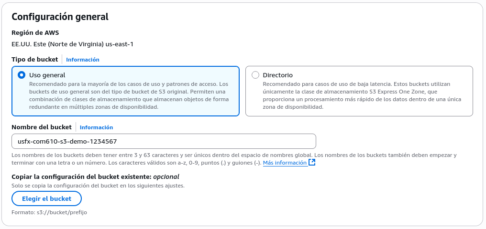

        - Tipo de bucket: **Uso general**
        - Nombre del bucket: `usfx-com610-s3-demo-1234567`. Donde `1234567` sea tu documento de identidad.


    - En **Propiedad de objetos** selecciona:

        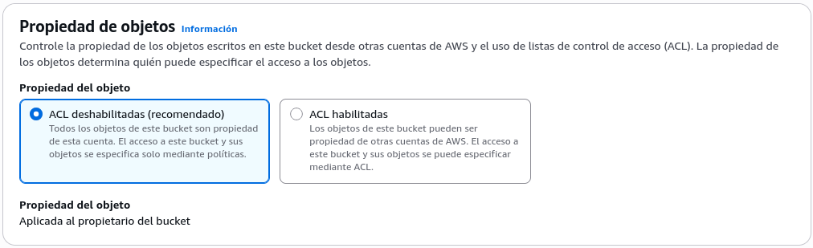

        - Propiedad del objeto: **ACL deshabilitadas (Recomendado)**

    - En **Configuración de bloqueo de acceso público para este bucket** dejar marcado **Bloquear todo el acceso público**.

    - En **Control de versiones de buckets** mantener en **Desactivar** la opción **Control de versiones de buckets**

    - En **Etiquetas** si deseas agregas las que quieras haciendo referencia al uso que le darás al Bucket.

    - En **Cifrado predeterminado** se mantiene el **Tipo de cifrado** por defecto y en **Clave de bucket** también el por defecto.

    - Por último, haz clic en el botón **Crear bucket**.


2. Utiliza **AWS IAM** para configurar el acceso al bucket.
    
    Ingresa a **Personas** y haz clic en **Crear persona**.

    - **Paso 1: Especificar los detalles de la persona**
        
        - En **Nombre de usuario** introduce `user-s3-demo` y haz clic en **Siguiente**.

    - **Paso 2: Establecer permisos**

        - En **Opciones de permisos** selecciona **Adjuntar políticas directamente**.

            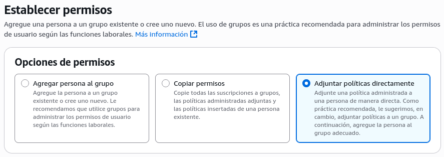

        - En **Políticas de permisos** busca `amazons3` y selecciona la política **AmazonS3FullAccess** y haz clic en **Siguiente**. OJO: esto lo haremos solo para efectos de práctica, luego se recomienda crear un grupo y otorgar políticas específicas, por ejemplo: de lectura y escritura para un específico Bucket.

            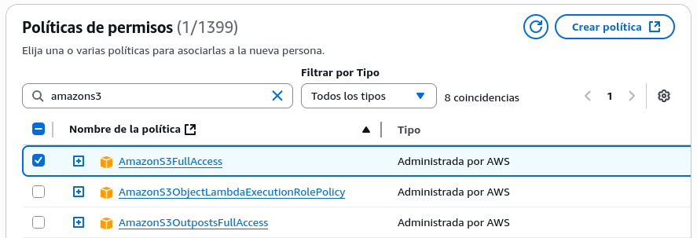

    - **Paso 3: Revisar y crear**

        - Revisa las opciones seleccionadas y todo está bien haz clic en **Crear Persona** para terminar.

3. Ingresa a **AWS CloudFront** para crear una red de distribución de contenido tomando como base el Bucket creado.

    - Una vez en CloudFront haz clic en **Create distribution**.

    - **Paso 1: Get started**

        - En **Distribution options**, introduce como nombre `cdn-s3-demo` y selecciona **Single website or app** en **Distribution type**.

            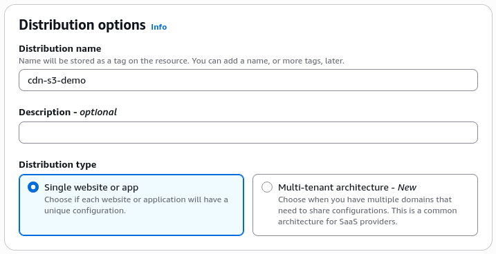

        - Deja las demás opciones por defecto y haz clic en **Next**.
    
    - **Paso 2: Specify origin**

        - En **Origin type** selecciona **Amazon S3**

            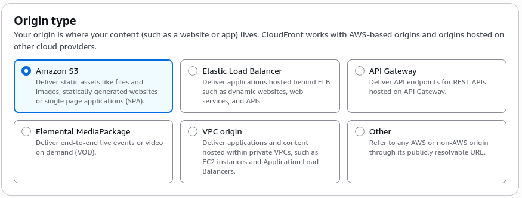  

        - En **Origin** selecciona el Bucket creado y que se utilizará como origen.

            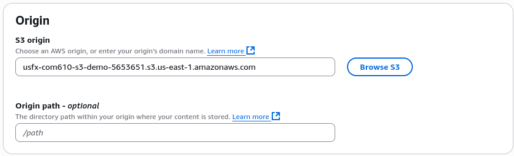

        - En **Settings** deja las opciones por defecto y haz clic en **Next**.

    - **Paso 3: Enable security**

        - En **Web Application Firewall (WAF)** selecciona **Do not enable security protections** para no habilitar protección con **WAF**.
    
    - **Paso 4: Review and create**

        - Revisa las opciones seleccionadas y todo está bien haz clic en **Create distribution** para terminar. 

4. Sube imágenes al Bucket creado desde **Amazon S3**

    - Ingresa a **AmazonS3**, selecciona el Bucket creado y sube archivos desde la pestaña **Objetos**.

    - Comprueba que los archivos estén disponibles en CDN de CloudFront. Para ello ingresa desde el navegador a la dirección del CDN (copia el Distribution domain name) y añade el nombre del archivo al final.

        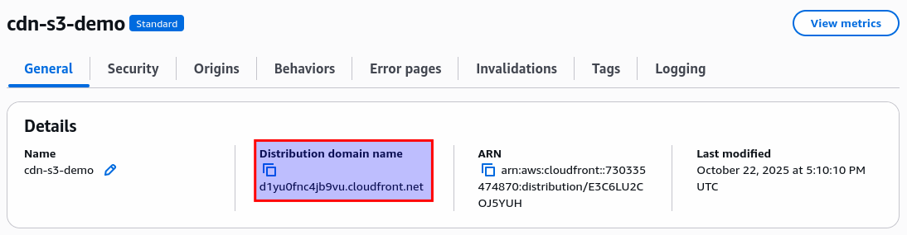
    
        Por ejemplo: ingresar desde el navegador a https://d1yu0fnc4jb9vu.cloudfront.net/sucre1.jpg

5. Subir y acceder a objetos del Bucket desde una aplicación NodeJS en nuestra PC.

    Para subir objetos desde una aplicación a un Bucket de AWS S3 debes crear una clave de acceso para un usuario ingresando a **Personas** de **AWS IAM**, luego seleccionando el usuario y haciendo clic en **Crear clave de acceso**.

    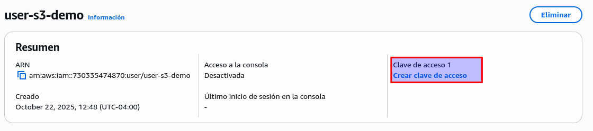

    - **Paso 1: Prácticas recomendadas y alternativas para la clave de acceso**

        - Seleccionar **Servicio de terceros** en **Casos de uso** y hacer clic en **Siguiente**.

            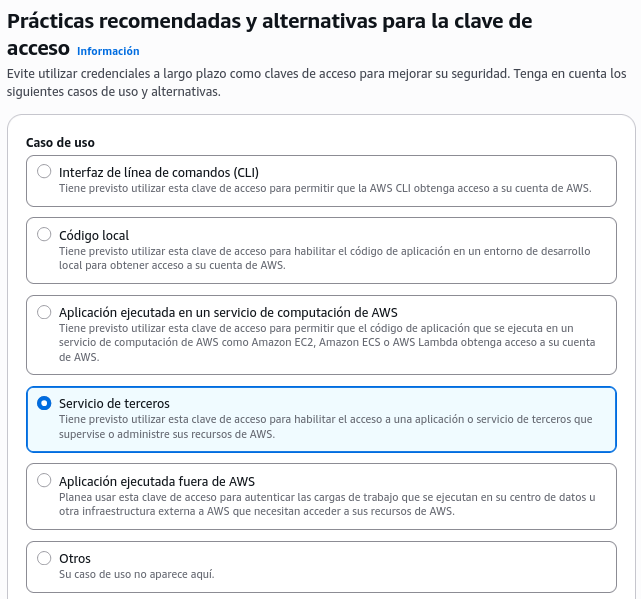

    - **Paso 2: Establecer el valor de etiqueta de descripción**

        - Mantiene los valores por defecto y haz clic en **Crear clave de acceso**

    - Paso 3: Recuperar claves de acceso

        -  Copia la **Clave de acceso** y **Clave de acceso secreta** en un lugar seguro

            

    
    Reemplaza la **Clave de acceso** y **Clave de acceso secreta** en proyecto de NestJS.

    - Clona el proyecto:

        ```bash
        git clone https://github.com/marceloquispeortega/aws-s3-upload-example
        ```
    
    - Instala dependencias del proyecto:

        ```bash
        npm install
        ```

    - Copia el archivo .env.example en .env y añade los valores de las variables de entorno.

        - `AWS_REGION`: región donde está ubicado el Bucket. Por ejemplo: us-east-1
        - `AWS_ACCESS_KEY_ID`: **Clave de acceso** del usuario de AWS IAM
        - `AWS_SECRET_ACCESS_KEY`: **Clave de acceso secreta** del usuario de AWS IAM
        - `AWS_S3_BUCKET_NAME`: nombre único del Bucket
        - `AWS_S3_CDN`: URL del CDN del CloudFront

    - Ejecuta la aplicación:

        ```bash
        npm run start:dev
        ```

    - Con **Postman** crea dos **Requests** para subir archivos y otro para descargar, los endpoints son:

        - `POST` `http://localhost:3000/files/upload`. Enviar el archivo tipo form-data con el key `file`.

            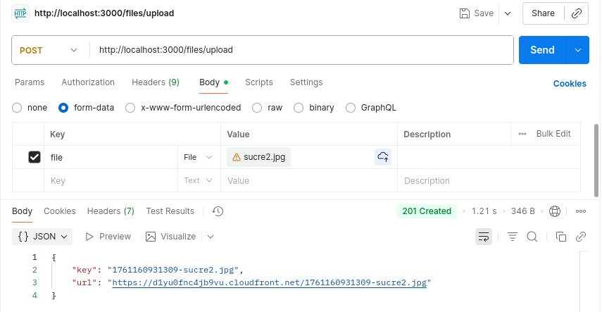

        - `GET` `http://localhost:3000/files/download/<filename>`. Enviar el como `filename` el nombre del archivo.

            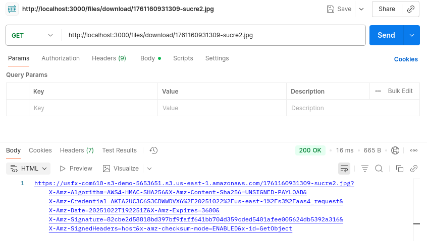


### Ejercicio 3.2: Implementación de un Balanceador de Carga (ALB)

1. **Crear grupos de seguridad para acceso Web (HTTP, HTTPS) y para acceso remoto (SSH)**

    - Haz clic sobre Crear grupo de seguridad y crea los grupos `web-securitygroup` y `ssh-seguritygroup`. 

        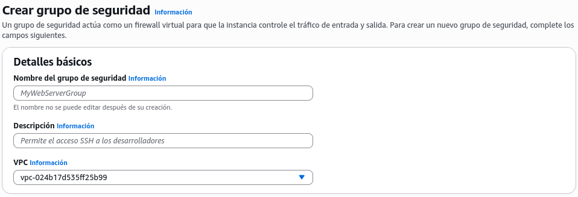
    
    - Para `web-securitygroup` crea Reglas de salida para HTTP y HTTPS

        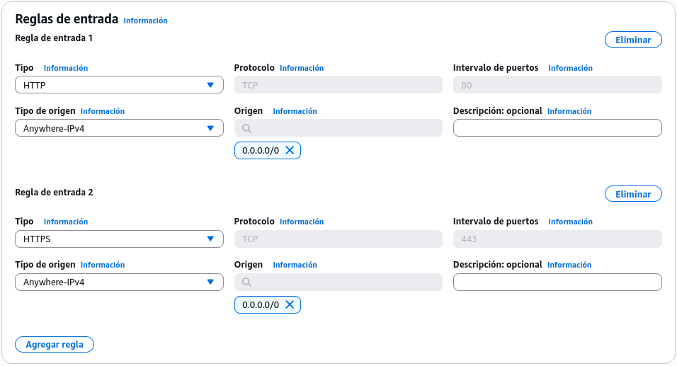

    - Y para `ssh-seguritygroup` crea Reglas de salida para SSH

        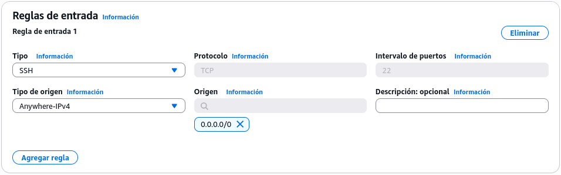

1. **Crea dos nuevas instancias con las siguientes características:**

    - **Nombre y etiquetas**

        - **Nombre:** `alb-server-1` para la primera instancia y `alb-server-2` para la segunda instancia.

    - **Imágenes de aplicaciones y sistemas operativos**
        
        - Selecciona *Inicio rápido* y selecciona **Ubuntu 24.04**.
            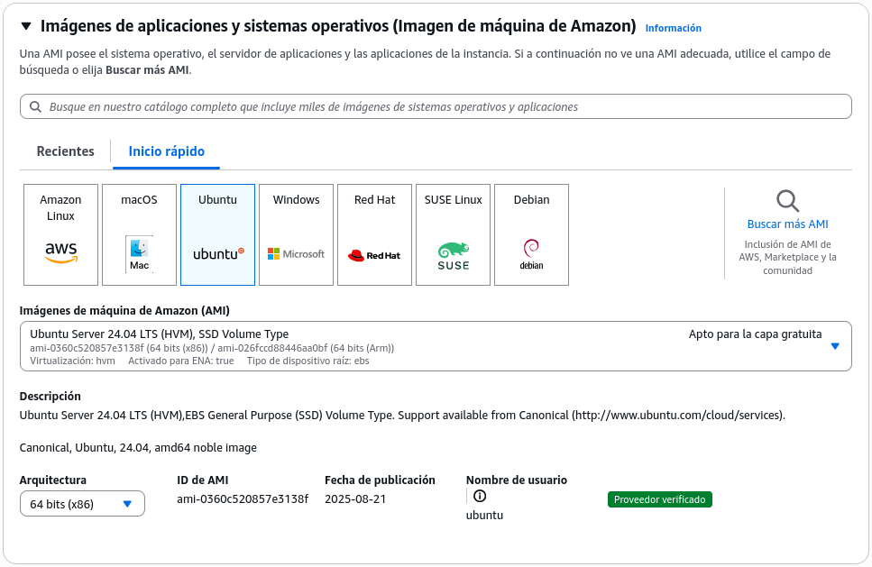

    - **Tipo de instancia:** `t3.micro` o `t2.micro`. Uno apto para la capa gratuita.

        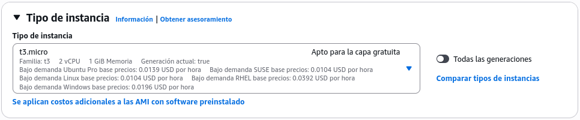

    - **Par de claves (inicio de sesión):** Continuar sin un par de claves

        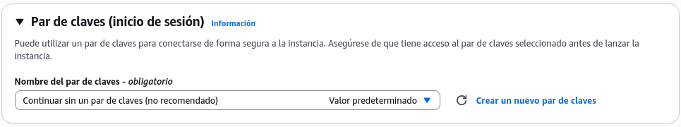

    - **Configuraciones de red:** 

        - Seleccionar **Seleccionar un grupo de seguridad existente** y selecciona las los grupos de seguridad `web-securitygroup`, `ssh-seguritygroup` y `default`.

            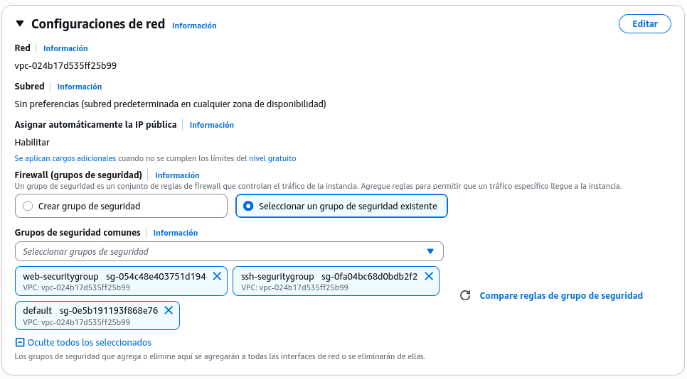

            > Debes hacer lo mismo para la segunda instancia.

    - **Configurar almacenamiento:** Mantener los valores por defecto

    - **Detalles avanzados**

        Dentro de **Datos de usuario** copiar el siguiente código:

        ```
        #!/bin/bash
        apt update -y
        apt install -y nginx
        systemctl start nginx
        systemctl enable nginx
        echo "<h1>Hola Mundo Server - $(hostname -f) con Nginx</h1>" > /var/www/html/index.nginx-debian.html
        ```

2. Configura un Balanceador de carga de tipo **ALB** (**Application Load Balancer**).

    Haz clic en **Crear balanceador de carga** y luego selecciona **Balanceador de carga de aplicaciones**.

    - **Configuración básica**

        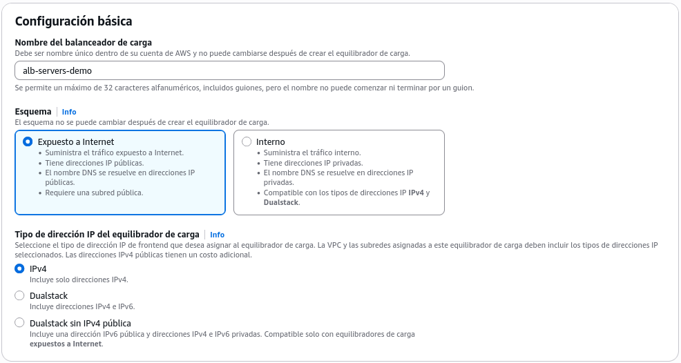

        - **Nombre del balanceador de carga:** `alb-servers-demo`

        - **Esquema:** Selecciona **Expuesto a Internet**

        - **Tipo de dirección IP del equilibrador de carga:** Selecciona **IPv4**

    - **Mapeo de red**

        - **VPC:** Mantiene el por defecto.

        - **Zonas de disponibilidad y subredes:** Marca todas las zonas de disponibilidad.

    - **Grupos de seguridad:** Selecciona los grupos de seguridad `web-securitygroup` y `default`.

    - **Agentes de escucha y direccionamiento**

        - Haz clic sobre **Cree un grupo de destino** 

            - **Paso 1: Create target group:** Selecciona **Instancias** como tipo de destino, escribe el nombre del grupo, mantiene los valores por defecto y haz clic en **Siguiente**.

                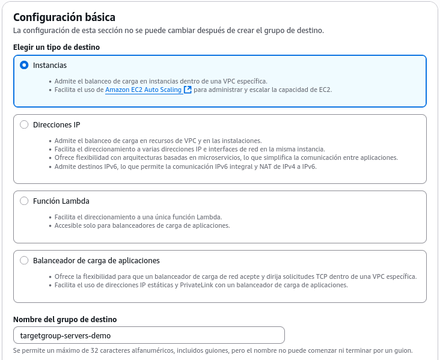

            - **Paso 2: Registrar destinos:** Selecciona las instancias `alb-server-1` y `alb-server-2` e incluyelas como destino. Y para finalizar haz clic en **Crear un grupo de destino**.

                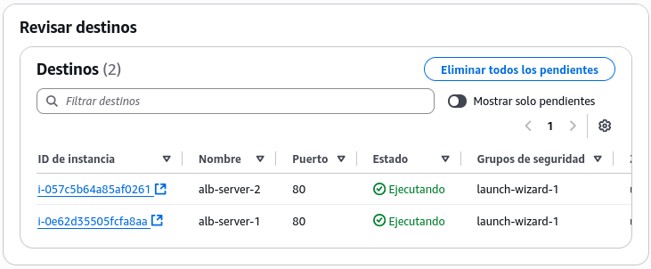

        - Selecciona el grupo de destino creado.

            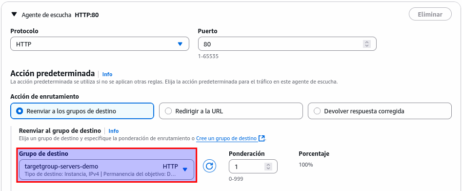

    - Deja las opciones por defecto y haz clic en **Crear balanceador de carga**.

### Ejercicio 3.3: Implementación de un Escalado Horizontal (ASG y ELB)

1. **Crea una instancia EC2 para preparar la Plantilla de lanzamiento**

    - Lanza una nueva instancia **Amazon EC2** dentro de la **capa gratuita** y asegurate que en **Configuraciones de red** se seleccionen los grupos de seguridad para Web (HTTP y HTTPS), acceso remoto (SSH) y crea un grupo de seguridad para conectarse a la instancia RDS de MySQL.

    - Accede a la instancia e realiza los siguientes pasos:

        - Actualizar los repositorios y paquetes:

            ```bash
            sudo apt update && sudo apt upgrade
            ```

        - Instalar **MySQL Client** para probar la conexión con el RDS.

            ```bash
            sudo apt install mysql-client
            ```

        - Instalar Node.js (instrucciones de [Web oficial de Node.js] (https://nodejs.org/es/download)):

            - Descarga e instala `nvm`:

                ```bash
                curl -o- https://raw.githubusercontent.com/nvm-sh/nvm/v0.40.3/install.sh | bash
                ```

            - En lugar de reiniciar la shell, ejecuta:

                ```bash
                \. "$HOME/.nvm/nvm.sh"
                ```

            - Descarga e instala `Node.js`:

                ```bash
                nvm install 22
                ```
            
            - Verifica la versión de `Node.js`:

                ```bash
                node -v 
                ```
                > Debería mostrar por ejemplo: "v22.21.0".

            - Verifica versión de `npm`:

                ```bash
                npm -v
                ```
                > Debería mostrar por ejemplo: "10.9.4"

        - Instala PM2 (instrucciones de [Web oficial de PM2](https://pm2.keymetrics.io/docs/usage/quick-start/)):

            - Instala el administrador de procesos `PM2` de forma global en tu sistema.

                ```bash
                npm install pm2@latest -g
                ```
            - Verifica la versión de PM2 instalada:

                ```bash
                pm2 --version
                ```
                > Debería mostrar por ejemplo: "6.0.13"

2. **Crear la instancia RDS MySQL:**

    Crea una instancia de base de datos MySQL en **Amazon RDS**, configurando los detalles como el motor, la clase de instancia, las credenciales y los grupos de seguridad. Sigue los siguientes pasos:

    - Ingresa a **Aurora and RDS** y haz clic en **Crear una base de datos**

    - En **Elegir un método de creación de base de datos** selecciona **Creación estándar**.

    - En **Opciones del motor** selecciona **MySQL**.

    - En **Plantillas** seleccione **Capa gratuita**.

        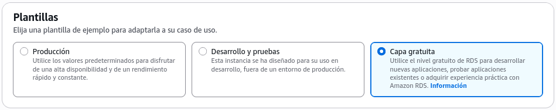

    - En **Disponibilidad y durabilidad** mantiene la opción seleccionada **Implementación de una instancia de base de datos de zona de disponibilidad única (1 instancia)**.

    - Dentro de **Configuración**:
    
        - En **Identificador de instancias de bases de datos** coloca el nombre de la instancia como `db-api-crud-demo`.
        
        - Dentro de **Configuración de credenciales**:
        
            - El **Nombre de usuario maestro** debe ser `admin`.
            
            - La **Administración de credenciales** como `Autoadministrado`.
            
            - Y por último introduce la contraseña.

    - En **Configuración de la instancia** mantiene las opciones por defecto.

    - En **Almacenamiento** deja los valores por defecto.

    - Dentro de **Conectividad**:
    
        - En **Recurso de computación** selecciona **Conectarse a un recurso informático de EC2** y selecciona la instancia EC2 que creaste en el ejercicio anterior.

            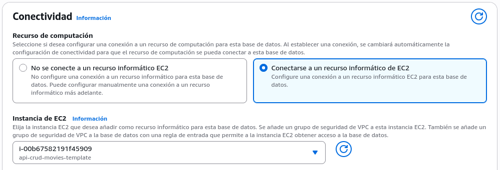

        - En **Nube privada virtual (VPC)** deja los valores por defecto.

        - En **Grupo de subredes de la base de datos** deja los valores por defecto.

        - En **Acceso público** selecciona **No**.

        - En **Grupo de seguridad de VPC (firewall)** selecciona **Elegir existente**.

        - En **Grupos de seguridad de VPC existentes** selecciona **default**.

        - En **Zona de disponibilidad** selecciona **Sin preferencia**.

        - Y por último, en **Proxy de RDS** y **Entidad de certificación** deja los valores por defecto.

    - En **Autenticación de bases de datos** selecciona **Autenticación con contraseña**.

    - En **Supervisión** deja los valores por defecto.

    - En **Configuración adicional** deja los valores por defecto.

3. **Prueba la conexión de la instancia EC2 con la instancia RDS y despliegue del API CRUD**

    - Ingresa a la instancia EC2 y conectate a la instancia RDS utilizando **MySQL Client**.

        ```bash
        mysql -U admin -h endpoint-del-rds -p
        ```
        > Deberías conectarte sin ningún problema.

    - Ya dentro del CLI de MySQL, crea una base de datos con el nombre `db_apimovies` y un usuario con privilegios para esa base de datos.

        ```mysql
        CREATE DATABASE db_apimovies;
        ```

        ```mysql
        CREATE USER 'usr_movies'@'%' IDENTIFIED BY 'secret';
        ```

        ```mysql
        GRANT ALL PRIVILEGES ON db_apimovies.* TO 'usr_movies'@'%';
        ```

        ```mysql
        FLUSH PRIVILEGES;
        ```

        > Se utiliz `%` para que cualquier IP de la subred se pueda conectar a RDS.

    - Clona el proyecto API CRUD Movies

        ```bash
        git clone https://github.com/marceloquispeortega/api-restful-crud-movies-nestjs
        ```

    - Configura el archivo `.env` con los datos de acceso modificando los valores de conexión de las variables `DB_HOST`, `DB_PORT`, `DB_USER`, `DB_PASS` y `DB_NAME`.

    - Genera el "build" del proyecto

        ```bash
        npm run build
        ```

    - Configura el PM2 para configurarlo desde el arranque

        ```bash
        pm2 start dist/main.js --name api -i 2
        ```

        ```bash
        pm2 save
        ```

        ```bash
        pm2 startup
        ```

        > Para completar se debe ejecutar el comando que sugiere el resultado de `pm2 startup`.

    - Instala `nginx` y configura el virtual host por defecto para habilitar el proxy inverso a la API CRUD.

        ```nginx
        server {
            listen 80 default_server; 
            listen [::]:80 default_server;

            server_name _;

            location / {
                proxy_pass http://127.0.0.1:3000;
                proxy_set_header Host $host;
                proxy_set_header X-Real-IP $remote_addr;
                proxy_set_header X-Forwarded-For $proxy_add_x_forwarded_for;
                proxy_set_header X-Forwarded-Proto $scheme;
            }
        }
        ```

    - Crea la **Imagen** a partir de esta instancia

        - Haz clic sobre el ID de la instancia, luego clic en **Acciones**, en **Imagen y plantillas** y en **Crear imagen**.

            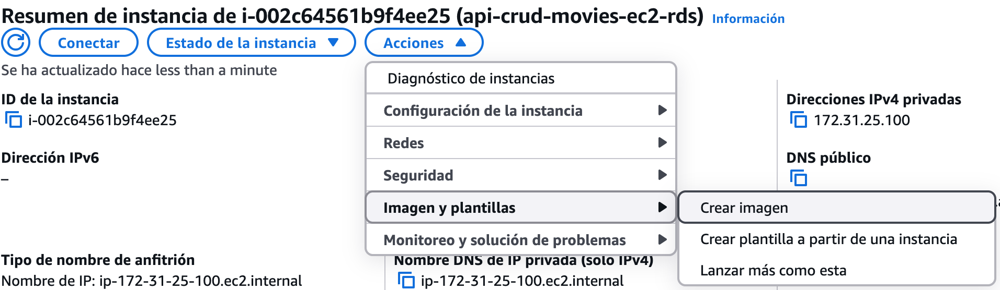

        - Introduce un nombre para la imagen, mantiene las demás opciones por defecto y haz clic en **Crear imagen**.

    - Crea la **Plantilla de lanzamiento** a partir de esta imagen

        - Accede a Plantillas de lanzamiento, coloca un nombre a la plantilla y descripción en **Nombre y descripción de la plantilla de lanzamiento**

            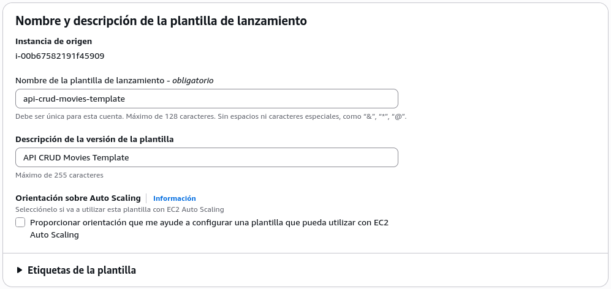

        - En **Imágenes de aplicaciones y sistemas operativos** selecciona **Mis AMI**, luego **De mi propiedad** y selecciona la imagen que creaste en el paso anterior.

            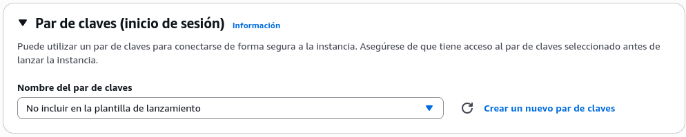

        - En **Tipo de instancia** selecciona un tipo **Apto para la capa gratuita**.

            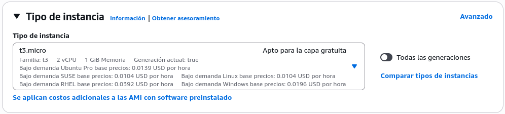

        - En **Par de claves** selecciona **No incluir en la plantilla de lanzamiento**.

            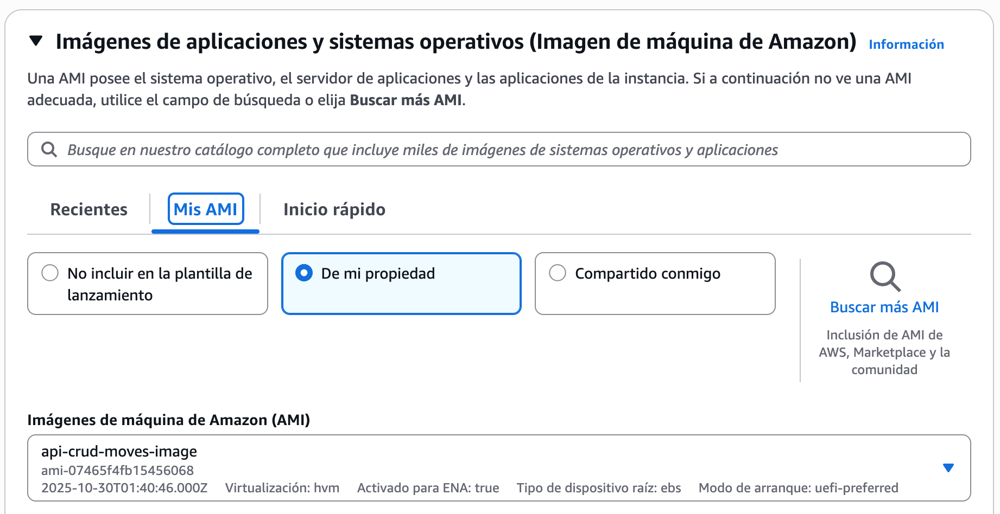

        - En **Configuraciones de red** debe tener los mismos grupos de seguridad de la instancia (Web, SSH y **ec2-rds-\*** para conectarse al RDS).

            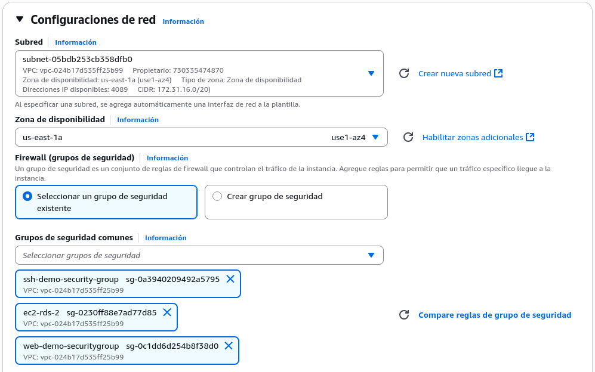

        - En **Almacenamiento** y **Detalle avanzados** mantiene los valores por defecto.

        - Por último, haz clic en **Crear plantilla de lanzamiento**.

4. **Configuración del ASG para que sea escalable:**

    - **Paso 1: Elegir plantilla de lanzamiento**

        - Introduce el nombre del grupo de Auto Scaling

            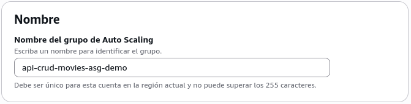

        - Selecciona la plantilla de lanzamiento

            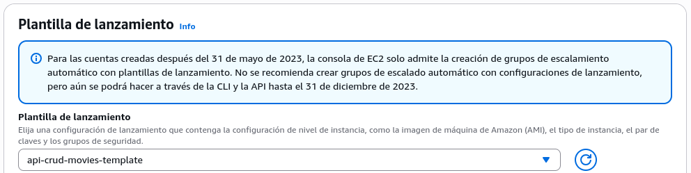

        - Clic en **Siguiente**

    - **Paso 2: Elegir las opciones de lanzamiento de instancias**

        - En **Red** selecciona las zonas de disponibilidad que te permita y en **Distribución de zonas de disponibilidad** selecciona **Mejor esfuerzo equilibrado**.

            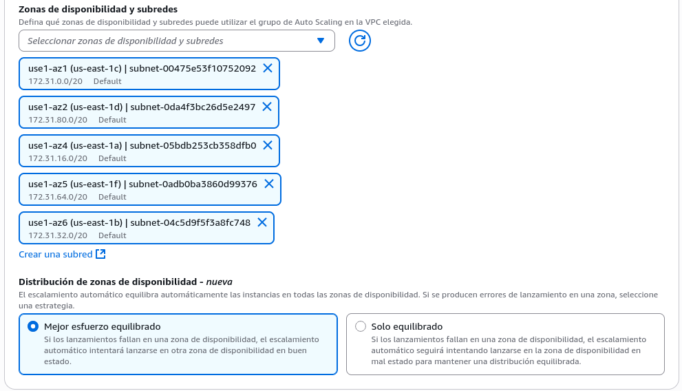

    - **Paso 3: Integrar en otros servicios**

        - En **Balance de carga**, selecciona **Crear nuevo balanceador de carga** del tipo **Application Load Balancer** y con esquema **Internet-facing**.

            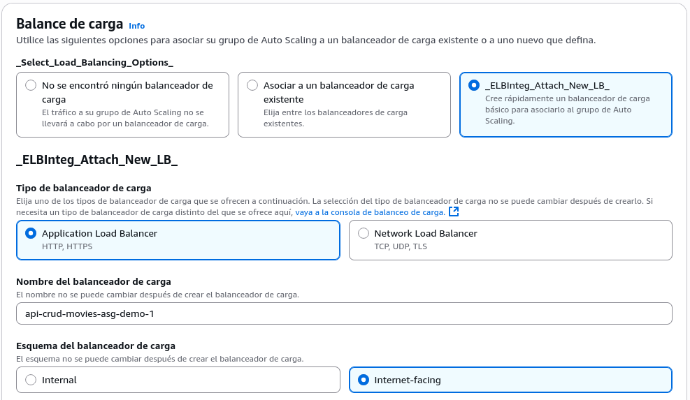

        - En **Zonas de disponibilidad y subredes** deja las por defecto y en **Agentes de escucha y direccionamiento** crea un grupo de destino.

            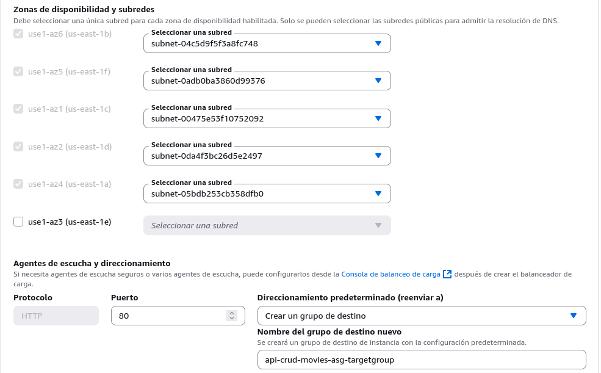

        - En **Opciones de integración de VPC Lattice** deja los valores por defecto.

        - En **Cambio de zona del controlador de recuperación de aplicaciones** deja los valores por defecto.

        - En **Comprobaciones de estado** deja los valores por defecto. 

    - **Paso 4: Configurar escalamiento y tamaño de grupo**

        - En **Tamaño del grupo** coloca 1 como **Capacidad deseada**.

            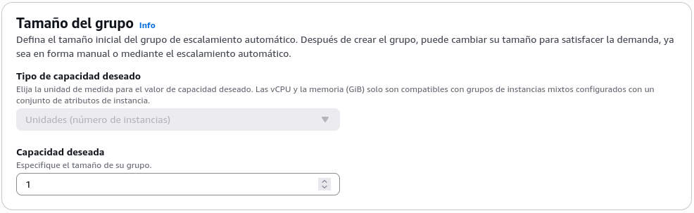

        - En **Escalado** coloca 1 como **Capacidad deseada mínima** y 4 como **Capacidad deseada máxima**.

            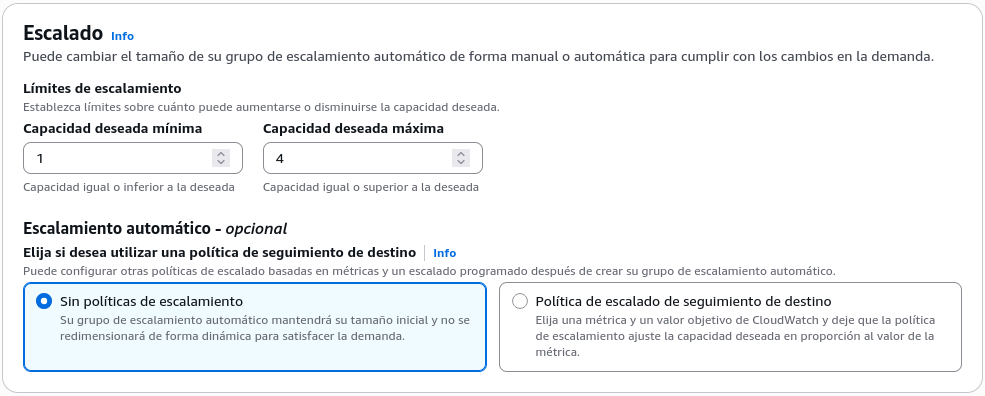

        - En **Política de mantenimiento de instancia** selecciona **Sin política**.

        - En **Ajustes de capacidad adicionales** y **Configuración adicional** deja los valores por defecto.

    - **Paso 5: Añadir notificación**

        - No hacer ningún cambio y hacer clic en **Siguiente**.

    - **Paso 6: Añadir etiquetas**

        - No agregar nada y hacer clic en **Siguiente**.

    - **Paso 7: Revisar**

        - Revisar la configuración y hacer clic en **Crear grupo de Auto Scaling**. 

    - **Crea una política de escalamiento dinámico**

        - Ingresa a **Grupos de Auto Scaling** y selecciona el grupo creado

            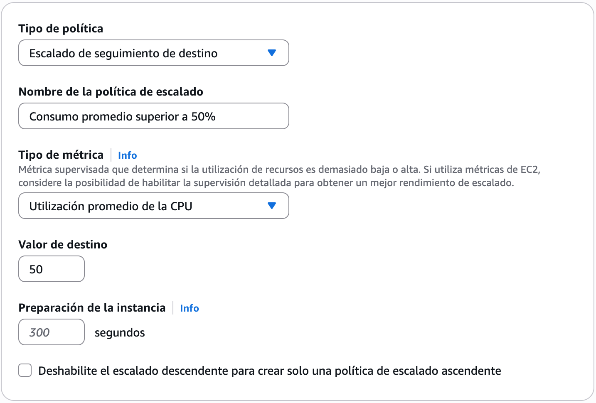

        - Haz clic en **Crear**

5. **Prueba de Escalabilidad:**

    - Escala manualmente el ASG a **2 réplicas (Capacidad deseada)** y espera a que las nuevas instancias se registren en el ELB. Verifica si se crearon nuevas instancias de las mismas.

    - Reduce manualmente el ASG a **1 réplica (Capacidad deseada)** y espera a que las nuevas instancias se eliminen del ELB.

6. **Verificación de Alta Disponibilidad:** 

    - Utiliza **Postman** (o herramienta similar) para ejecutar **múltiples peticiones (ej., 100)** en bucle contra el endpoint `CREATE` o `UPDATE` de la API a través del subdominio, demostrando que todas las réplicas responden y los datos se persisten correctamente en RDS.
    
    - Realiza pruebas de estrés en el procesador
    
        - Instala stress-ng en una instancia y estresa uno de los 2 procesadores de dicha instancia.

            ```bash
            sudo apt install stress-ng
            ```

            ```bash
            nohup stress-ng -c 1 -t 300s &
            ```

        - Verifica el estrés del procesador con `htop`

            ```bash
            htop
            ```

            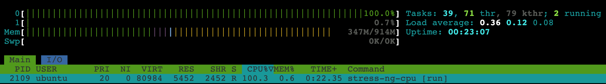

        - Por último, verifica el lanzamiento de las nuevas instancias después de estresar el procesador. Puedes también revisar el **Historial de actividad** del Grupo de Auto Scaling.

El resultado final es una aplicación **elástica y segura**, probada y accesible a través de un dominio y con Swagger habilitado en http://`endpoint-del-ELB`/api. 
