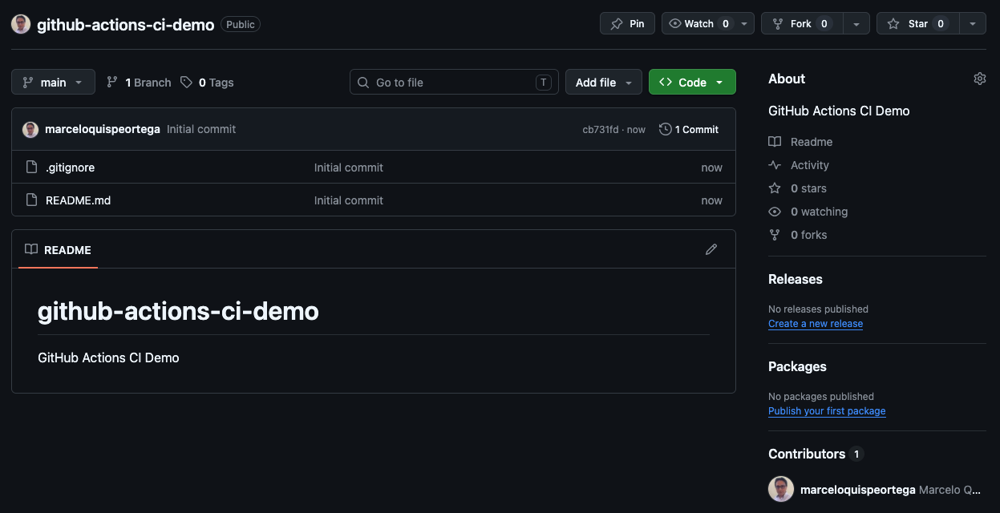
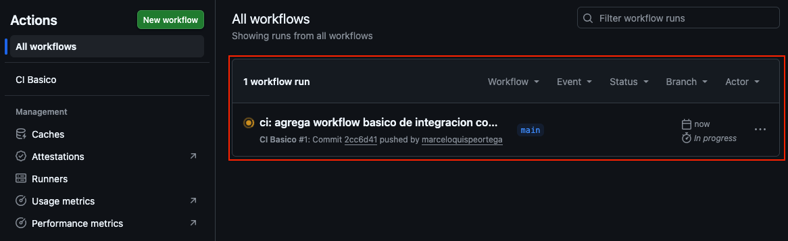
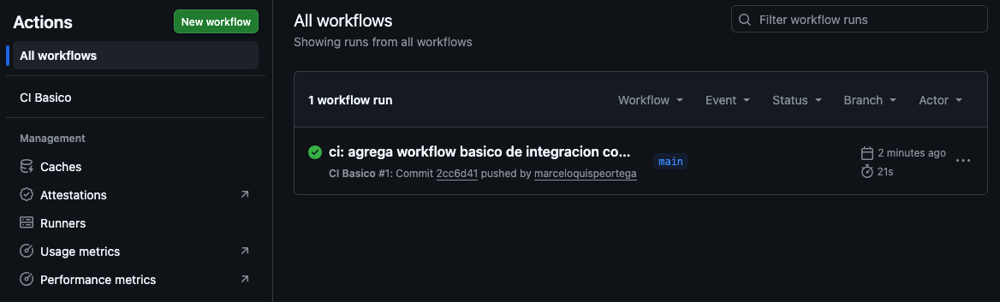
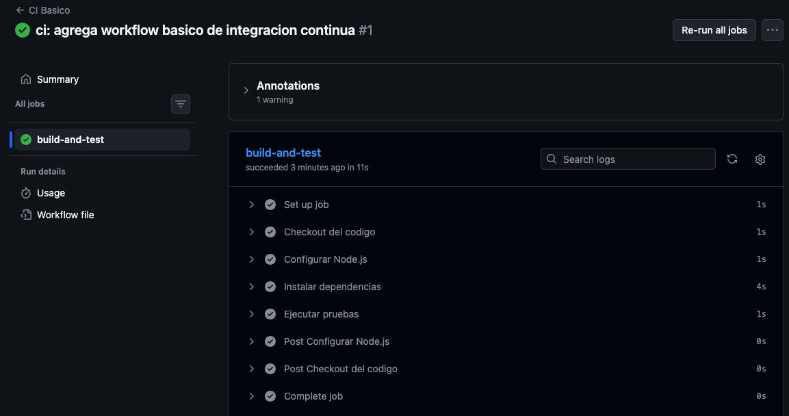
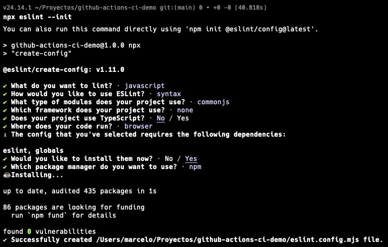
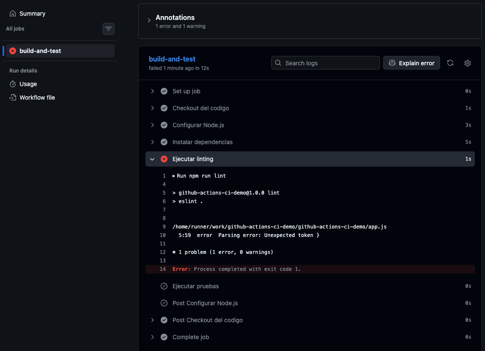
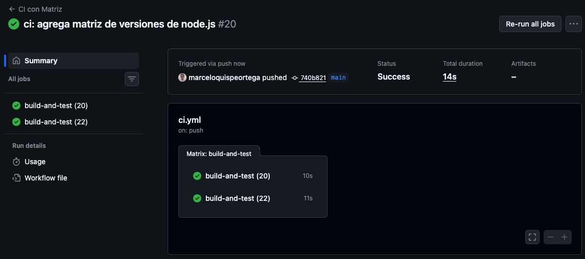

# Laboratorio 5.1: Creación de un Workflow de GitHub Actions para CI 🚀

## 1. Objetivos del Laboratorio 🎯

Al finalizar este laboratorio, el estudiante será capaz de:

- Comprender la estructura y los componentes de un **workflow de GitHub Actions**.
- Crear y configurar un archivo `.github/workflows/ci.yml` desde cero.
- Automatizar la compilación y la ejecución de pruebas ante eventos de `push` y `pull_request`.
- Interpretar los resultados de ejecución en la pestaña **Actions** de GitHub.
- Aplicar buenas prácticas de CI, como el linting de código y las matrices de ejecución.
- Configurar protecciones de rama que garanticen la calidad del código antes de integrarlo.

## 2. Requisitos ⚙️

- Tener una cuenta activa de **GitHub**.
- Tener **Git** instalado localmente.
- Tener instalado **Node.js** (versión 18 o superior) y **npm**.
- Tener un editor de código (se recomienda **VS Code**).
- Disponer de un navegador web para acceder a la interfaz de GitHub.

## 3. Ejercicios 🧪

### Ejercicio 3.1: Preparación del repositorio y la aplicación

1. Crea un nuevo repositorio público en GitHub con el nombre `github-actions-ci-demo`.

    

2. Clona el repositorio en tu máquina local:

    ```bash
    git clone https://github.com/TU_USUARIO/github-actions-ci-demo.git
    cd github-actions-ci-demo
    ```

3. Inicializa un proyecto de Node.js y crea una aplicación sencilla con pruebas unitarias:

    ```bash
    npm init -y
    npm install express
    npm install --save-dev jest supertest
    ```

4. Crea un archivo `app.js` con el siguiente contenido:

    ```javascript
    const express = require('express');
    const app = express();
    app.use(express.json());

    app.get('/health', (req, res) => {
      res.status(200).json({ status: 'ok' });
    });

    app.get('/users', (req, res) => {
      res.status(200).json([
        { id: 1, name: 'Alice' },
        { id: 2, name: 'Bob' }
      ]);
    });

    module.exports = app;
    ```

5. Crea un archivo `server.js` para iniciar el servidor:

    ```javascript
    const app = require('./app');
    const PORT = process.env.PORT || 3000;

    app.listen(PORT, () => {
      console.log(`Servidor escuchando en el puerto ${PORT}`);
    });
    ```

6. Crea un archivo `app.test.js` con las siguientes pruebas:

    ```javascript
    const request = require('supertest');
    const app = require('./app');

    describe('API Tests', () => {
      test('GET /health debe retornar status ok', async () => {
        const res = await request(app).get('/health');
        expect(res.statusCode).toBe(200);
        expect(res.body.status).toBe('ok');
      });

      test('GET /users debe retornar una lista de usuarios', async () => {
        const res = await request(app).get('/users');
        expect(res.statusCode).toBe(200);
        expect(Array.isArray(res.body)).toBe(true);
        expect(res.body.length).toBe(2);
      });
    });
    ```

7. Modifica el archivo `package.json` para agregar el script de pruebas:

    ```json
    {
      "name": "github-actions-ci-demo",
      "version": "1.0.0",
      "description": "GitHub Actions CI Demo",
      "main": "server.js",
      "scripts": {
        "start": "node server.js",
        "test": "jest"
      },
      "dependencies": {
        "express": "^5.2.1"
      },
      "devDependencies": {
        "jest": "^30.3.0",
        "supertest": "^7.2.2"
      }
    }
    ```

8. Ejecuta las pruebas localmente para verificar que todo funciona:

    ```bash
    npm test
    ```

    > Deberías ver un mensaje indicando que las 2 pruebas pasaron correctamente.

9. Crea un archivo `.gitignore`:

    ```bash
    node_modules/
    .env
    ```

10. Realiza el primer commit y súbelo a GitHub:

    ```bash
    git add .
    git commit -m "feat: inicializa aplicacion express con pruebas unitarias"
    git push origin main
    ```

### Ejercicio 3.2: Creación del workflow de CI

1. En la raíz del repositorio local, crea la carpeta y el archivo del workflow:

    ```bash
    mkdir -p .github/workflows
    touch .github/workflows/ci.yml
    ```

2. Abre el archivo `.github/workflows/ci.yml` y agrega el siguiente contenido:

    ```yaml
    name: CI Basico

    on:
      push:
        branches: [main]
      pull_request:
        branches: [main]

    jobs:
      build-and-test:
        runs-on: ubuntu-latest

        steps:
          - name: Checkout del codigo
            uses: actions/checkout@v6

          - name: Configurar Node.js
            uses: actions/setup-node@v6
            with:
              node-version: '20'

          - name: Instalar dependencias
            run: npm ci

          - name: Ejecutar pruebas
            run: npm test
    ```

    > **Nota:** La instrucción `npm ci` es similar a `npm install`, pero está optimizada para entornos de CI porque instala exactamente las versiones definidas en `package-lock.json`.

3. Guarda los cambios, realiza commit y push:

    ```bash
    git add .github/workflows/ci.yml
    git commit -m "ci: agrega workflow basico de integracion continua"
    git push origin main
    ```

4. Ve a la pestaña **Actions** de tu repositorio en GitHub y verifica que el workflow se haya ejecutado exitosamente.

    

    

5. Haz clic sobre el nombre del workflow (`CI Basico`) y luego sobre el job `build-and-test` para inspeccionar los logs de cada paso.

    

### Ejercicio 3.3: Extensión del pipeline con calidad de código

1. Instala **ESLint** localmente como dependencia de desarrollo:

    ```bash
    npm install --save-dev eslint
    npx eslint --init
    ```

    > Durante la configuración inicial de ESLint, selecciona las opciones para un proyecto de Node.js y el estilo que prefieras.

    

2. Agrega un script de linting en el `package.json`:

    ```json
    "scripts": {
      "start": "node server.js",
      "test": "jest",
      "lint": "eslint ."
    }
    ```

3. Modifica el archivo `.github/workflows/ci.yml` para incluir el paso de linting **antes** de las pruebas:

    ```yaml
    name: CI con Linting

    on:
      push:
        branches: [main]
      pull_request:
        branches: [main]

    jobs:
      build-and-test:
        runs-on: ubuntu-latest

        steps:
          - name: Checkout del codigo
            uses: actions/checkout@v6

          - name: Configurar Node.js
            uses: actions/setup-node@v6
            with:
              node-version: '20'

          - name: Instalar dependencias
            run: npm ci

          - name: Ejecutar linting
            run: npm run lint

          - name: Ejecutar pruebas
            run: npm test
    ```

4. Realiza commit y push de los cambios:

    ```bash
    git add .
    git commit -m "ci: agrega paso de linting al pipeline"
    git push origin main
    ```

5. Verifica en la pestaña **Actions** que el pipeline sigue pasando correctamente.

6. **Forzar un fallo intencional:** modifica el archivo `app.js` introduciendo un error de sintaxis o una variable no utilizada (dependiendo de tu configuración de ESLint). Por ejemplo:

    ```javascript
    const unusedVariable = 'esto causara un error de linting';
    ```

7. Realiza commit y push de este cambio:

    ```bash
    git add app.js
    git commit -m "test: fuerza un error de linting para probar el pipeline"
    git push origin main
    ```

8. Observa en la pestaña **Actions** cómo el workflow **falla** en el paso de linting y el job se marca con una ❌.

    

9. Revierte o corrige el error intencional, haz commit y push nuevamente para confirmar que el workflow vuelve a pasar.

### Ejercicio 3.4: Uso de matrices de ejecución

1. Modifica el workflow para que las pruebas se ejecuten en paralelo con múltiples versiones de Node.js (18 y 20):

    ```yaml
    name: CI con Matriz

    on:
      push:
        branches: [main]
      pull_request:
        branches: [main]

    jobs:
      build-and-test:
        runs-on: ubuntu-latest

        env:
          FORCE_JAVASCRIPT_ACTIONS_TO_NODE24: true

        strategy:
          matrix:
            node-version: [18, 20]

        steps:
          - name: Checkout del codigo
            uses: actions/checkout@v6

          - name: Configurar Node.js ${{ matrix.node-version }}
            uses: actions/setup-node@v6
            with:
              node-version: ${{ matrix.node-version }}

          - name: Instalar dependencias
            run: npm ci

          - name: Ejecutar linting
            run: npm run lint

          - name: Ejecutar pruebas
            run: npm test
    ```

2. Realiza commit y push:

    ```bash
    git add .github/workflows/ci.yml
    git commit -m "ci: agrega matriz de versiones de node.js"
    git push origin main
    ```

3. Ve a la pestaña **Actions** y verifica que se han generado **dos jobs en paralelo**, uno para Node.js 20 y otro para Node.js 22.

    

## 4. Práctica Individual 💻

El estudiante debe reforzar los conocimientos adquiridos aplicándolos a un proyecto propio. Puedes reutilizar la **API CRUD** desarrollada en laboratorios anteriores o crear una nueva aplicación sencilla.

1. Crea un nuevo repositorio en GitHub (público o privado) con una aplicación que tenga:
   - Al menos una entidad de dominio con operaciones CRUD.
   - Pruebas unitarias o de integración que cubran las principales funcionalidades.
   - Un framework moderno como **NestJS**, **Express**, **Django REST Framework**, **Spring Boot** u otro equivalente.

2. Configura un workflow de CI completo que incluya:
   - **Checkout** del código.
   - **Setup** del entorno de ejecución (Node.js, Python, Java, etc.).
   - **Instalación** de dependencias.
   - **Compilación/build** (si el lenguaje lo requiere).
   - **Linting** o análisis estático de código.
   - **Ejecución de pruebas** unitarias e integrales.
   - **Generación de reporte de cobertura** (ej. `jest --coverage`, `pytest-cov`, `jacoco`).

3. Configura una **regla de protección de rama** en GitHub para `main` que:
   - Requiera que el workflow de CI pase antes de permitir un *merge*.
   - (Opcional) Requiera revisión de código antes del *merge*.

    > Ve a **Settings > Branches > Add rule** y habilita **Require status checks to pass before merging**. Selecciona el nombre de tu workflow como check obligatorio.

4. Crea una **pull request** desde una rama de feature hacia `main`, introduce un cambio menor y verifica que:
   - El workflow de CI se ejecuta automáticamente.
   - GitHub bloquea el *merge* hasta que el check pase.
   - Una vez aprobado, puedes fusionar la rama.

5. Dentro del mismo repositorio, crea un archivo `INFORME.md` en la raíz que contenga:
   - Una breve descripción del proyecto y del pipeline configurado.
   - Capturas de pantalla que demuestren:
     - El historial de ejecuciones en la pestaña **Actions**.
     - El detalle de un workflow exitoso con cobertura.
     - El detalle de un workflow fallido (puedes forzarlo intencionalmente).
     - La configuración de la regla de protección de rama.
   - Conclusiones y reflexión sobre la utilidad de CI en el proyecto.

6. En el archivo `README.md` del repositorio, agrega una sección de **Documentación** o **Entrega** que enlace al `INFORME.md`. Por ejemplo:

    ```markdown
    ## Documentación del Laboratorio

    Puedes encontrar el informe completo con capturas de pantalla y evidencias en el siguiente enlace:

    - [Ver informe del laboratorio](./INFORME.md)
    ```

La práctica se considerará exitosa al presentar el enlace al repositorio, donde se podrá acceder tanto al código fuente como al `README.md` y al `INFORME.md` con todas las evidencias del funcionamiento completo del pipeline de CI.
