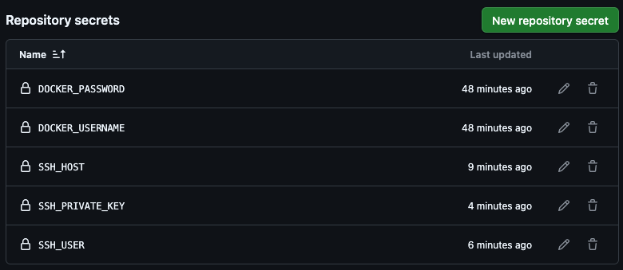
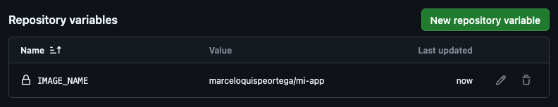
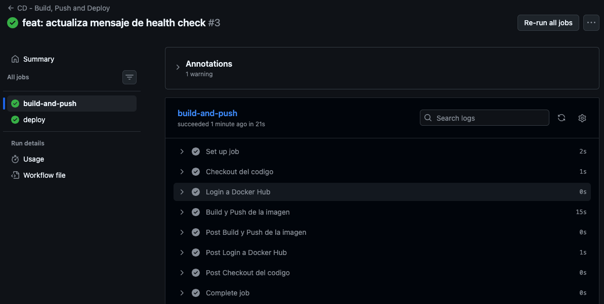
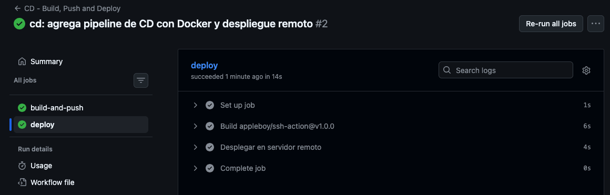
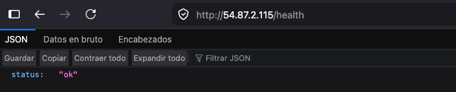
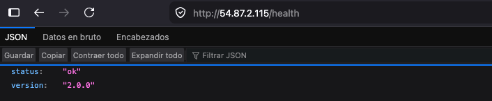

# Laboratorio 5.2: Configuración de un Pipeline de Despliegue Continuo con Docker 🐳

## 1. Objetivos del Laboratorio 🎯

Al finalizar este laboratorio, el estudiante será capaz de:

- Comprender el flujo completo de **CI/CD con contenedores Docker**.
- Crear un `Dockerfile` optimizado con **build de múltiples etapas (multi-stage)**.
- Configurar un workflow de GitHub Actions que automatice el **build**, **push** y **deploy** de una imagen Docker.
- Gestionar **secretos** de forma segura (Docker Hub, SSH, credenciales de AWS).
- Desplegar una imagen Docker en un **servidor remoto (EC2)** de forma automatizada.
- Aplicar buenas prácticas de **versionamiento y etiquetado** de imágenes.
- Entender el concepto de **rollback** y cómo revertir a una versión anterior.

## 2. Requisitos ⚙️

- Tener completado el **Laboratorio 5.1** (cuenta de GitHub activa, repositorio con CI funcional).
- Tener una cuenta en **Docker Hub**.
- Tener acceso a una instancia **EC2** (o cualquier servidor Linux con Docker instalado) como objetivo de despliegue.
- Tener un **par de claves SSH** para conectarse a la instancia remota.
- Tener instalado localmente **Docker** (opcional, pero recomendado para pruebas locales).
- Disponer del código fuente de una **API funcional** (puede ser la del Laboratorio 5.1 o la API CRUD de laboratorios anteriores).

## 3. Ejercicios 🧪

### Ejercicio 3.1: Creación del Dockerfile y prueba local

1. Asegúrate de estar en la raíz del repositorio del proyecto que vas a contenerizar. Si continuas con el proyecto del Laboratorio 5.1, ubícate en esa carpeta.

2. Crea un archivo `Dockerfile` con un build de **múltiples etapas**. El siguiente ejemplo está basado en una aplicación Node.js, ajústalo según el runtime de tu proyecto:

    ```dockerfile
    # Etapa 1: Build
    FROM node:20-alpine AS builder
    WORKDIR /app
    COPY package*.json ./
    RUN npm ci --only=production
    COPY . .

    # Etapa 2: Runtime
    FROM node:20-alpine
    WORKDIR /app
    COPY --from=builder /app/node_modules ./node_modules
    COPY --from=builder /app/package*.json ./
    COPY --from=builder /app/app.js ./
    COPY --from=builder /app/server.js ./
    EXPOSE 3000
    CMD ["node", "server.js"]
    ```

    > **Nota:** El build multi-stage reduce drásticamente el tamaño de la imagen final porque solo copia los artefactos necesarios, descartando herramientas de compilación intermedias.

3. Crea un archivo `.dockerignore` en la raíz para evitar copiar archivos innecesarios al contexto de build:

    ```text
    node_modules
    npm-debug.log
    .git
    .github
    .env
    Dockerfile
    .dockerignore
    ```

4. Construye la imagen localmente para validar que no hay errores:

    ```bash
    docker build -t mi-app:local .
    ```

5. Ejecuta un contenedor a partir de la imagen y prueba que responde:

    ```bash
    docker run -d -p 3000:3000 --name app-local mi-app:local
    curl http://localhost:3000/health
    ```

    > Deberías recibir la respuesta JSON con `{ "status": "ok" }`.

6. Detén y elimina el contenedor de prueba:

    ```bash
    docker stop app-local && docker rm app-local
    ```

7. Sube los archivos `Dockerfile` y `.dockerignore` al repositorio:

    ```bash
    git add Dockerfile .dockerignore
    git commit -m "feat: agrega Dockerfile multi-stage para contenerizacion"
    git push origin main
    ```

### Ejercicio 3.2: Configuración de secretos en GitHub

1. Accede a tu repositorio en GitHub y ve a **Settings > Secrets and variables > Actions**.

2. Haz clic en **New repository secret** y crea los siguientes secretos:

    | Nombre del secreto | Valor esperado |
    |---|---|
    | `DOCKER_USERNAME` | Tu nombre de usuario en Docker Hub |
    | `DOCKER_PASSWORD` | Un **Access Token** de Docker Hub (no uses tu contraseña principal) |
    | `SSH_HOST` | La dirección IP pública de tu instancia EC2 |
    | `SSH_USER` | El usuario SSH (ej. `ubuntu`, `ec2-user`) |
    | `SSH_PRIVATE_KEY` | El contenido completo de tu llave privada `.pem` |

    

    > **Nota:** Para generar un Access Token en Docker Hub, ve a **Account Settings > Security > New Access Token**. Esto es más seguro que usar tu contraseña.

3. (Opcional pero recomendado) Crea también una variable de repositorio (no secreta) para el nombre de la imagen:

    - Ve a la pestaña **Variables** dentro de **Secrets and variables > Actions**.
    - Crea la variable `IMAGE_NAME` con el valor `TU_USUARIO_DOCKERHUB/mi-app`.

    

### Ejercicio 3.3: Workflow de Build, Push y Deploy

1. Crea el archivo `.github/workflows/cd.yml` con el siguiente contenido. Este workflow se divide en dos jobs: uno para construir y publicar la imagen, y otro para desplegarla en el servidor remoto.

    ```yaml
    name: CD - Build, Push and Deploy

    on:
      push:
        branches: [main]
      pull_request:
        branches: [main]

    jobs:
      build-and-push:
        runs-on: ubuntu-latest

        env:
          FORCE_JAVASCRIPT_ACTIONS_TO_NODE24: true

        steps:
          - name: Checkout del codigo
            uses: actions/checkout@v6

          - name: Login a Docker Hub
            uses: docker/login-action@v3
            with:
              username: ${{ secrets.DOCKER_USERNAME }}
              password: ${{ secrets.DOCKER_PASSWORD }}

          - name: Build y Push de la imagen
            uses: docker/build-push-action@v5
            with:
              context: .
              push: true
              tags: |
                ${{ secrets.DOCKER_USERNAME }}/mi-app:${{ github.sha }}
                ${{ secrets.DOCKER_USERNAME }}/mi-app:latest

      deploy:
        needs: build-and-push
        runs-on: ubuntu-latest
        steps:
          - name: Desplegar en servidor remoto
            uses: appleboy/ssh-action@v1.0.0
            with:
              host: ${{ secrets.SSH_HOST }}
              username: ${{ secrets.SSH_USER }}
              key: ${{ secrets.SSH_PRIVATE_KEY }}
              script: |
                docker pull ${{ secrets.DOCKER_USERNAME }}/mi-app:latest
                docker stop mi-app || true
                docker rm mi-app || true
                docker run -d \
                  --name mi-app \
                  --restart unless-stopped \
                  -p 80:3000 \
                  ${{ secrets.DOCKER_USERNAME }}/mi-app:latest
                docker system prune -f
    ```

    > **Nota:** El job `deploy` usa `needs: build-and-push` para garantizar que solo se ejecute si el build y el push fueron exitosos.

2. Realiza commit y push del workflow:

    ```bash
    git add .github/workflows/cd.yml
    git commit -m "cd: agrega pipeline de CD con Docker y despliegue remoto"
    git push origin main
    ```

3. Ve a la pestaña **Actions** de GitHub y verifica que el workflow se ejecute. Deberías ver dos jobs ejecutándose de forma secuencial:

    - Primero `build-and-push` (compila y sube la imagen).
    - Luego `deploy` (conecta por SSH y reinicia el contenedor).

    

    

4. Una vez que ambos jobs terminen con éxito ✅, abre tu navegador y accede a la **IP pública** de tu instancia EC2 para validar que la aplicación responde.

    ```
    http://IP_DE_TU_EC2/health
    ```

    

### Ejercicio 3.4: Verificación del despliegue y rollbacks

1. Realiza un cambio visible en el código. Por ejemplo, modifica el endpoint `/health` en `app.js` para que retorne un mensaje diferente:

    ```javascript
    app.get('/health', (req, res) => {
      res.status(200).json({ status: 'ok', version: '2.0.0' });
    });
    ```

2. Guarda los cambios, haz commit y push:

    ```bash
    git add app.js
    git commit -m "feat: actualiza mensaje de health check"
    git push origin main
    ```

3. Observa cómo el pipeline de CD se dispara automáticamente. Espera a que finalice.

4. Refresca la URL de tu EC2 y verifica que el cambio esté reflejado en la respuesta.

    

5. **Rollback manual:** Imagina que el cambio recién desplegado tiene un error crítico. Como etiquetamos la imagen con el `github.sha`, puedes volver a una versión anterior sin necesidad de reconstruirla. Explica en tu informe cómo realizarías el rollback ejecutando los siguientes comandos directamente en el servidor remoto:

    ```bash
    # Reemplaza SHA_ANTERIOR por el SHA del commit anterior
    docker pull TU_USUARIO/mi-app:SHA_ANTERIOR
    docker stop mi-app
    docker rm mi-app
    docker run -d --name mi-app --restart unless-stopped -p 80:3000 TU_USUARIO/mi-app:SHA_ANTERIOR
    ```

    > **Reflexión:** El etiquetado con el SHA del commit permite identificar exactamente qué versión del código está corriendo en cada imagen, facilitando los rollbacks y la trazabilidad.

## 4. Práctica Individual 💻

El estudiante debe demostrar autonomía extendiendo lo aprendido a un proyecto propio. Puedes reutilizar la **API CRUD** desarrollada en laboratorios anteriores o crear una nueva aplicación.

1. Configura un pipeline de CD completo en un repositorio propio que incluya:
   - Un `Dockerfile` con **multi-stage build** optimizado.
   - Un workflow de GitHub Actions con al menos **dos jobs** (`build-and-push`, `deploy`).
   - Push de la imagen a **Docker Hub** con etiquetado semántico (ej. `v1.0.0`) o con el SHA del commit.
   - Despliegue automatizado en una **instancia remota** (EC2, Lightsail o un servidor propio con Docker).

2. Configura al menos **dos entornos** en GitHub (por ejemplo, `staging` y `production`) usando **GitHub Environments**:
   - Ve a **Settings > Environments** y crea los entornos.
   - Asigna **Environment Secrets** específicos para cada entorno (diferentes hosts, usuarios o llaves SSH).
   - Modifica el workflow para que el job de `deploy` apunte a un environment:

    ```yaml
    deploy:
      needs: build-and-push
      runs-on: ubuntu-latest
      environment: production
      steps:
        - name: Desplegar en produccion
          uses: appleboy/ssh-action@v1.0.0
          with:
            host: ${{ secrets.SSH_HOST }}
            username: ${{ secrets.SSH_USER }}
            key: ${{ secrets.SSH_PRIVATE_KEY }}
            script: |
              docker pull ${{ secrets.DOCKER_USERNAME }}/mi-app:latest
              docker stop mi-app || true
              docker rm mi-app || true
              docker run -d --name mi-app --restart unless-stopped -p 80:3000 ${{ secrets.DOCKER_USERNAME }}/mi-app:latest
    ```

3. Incluye un paso de **escaneo de vulnerabilidades** en tu pipeline. Puedes usar `docker/scout-action` o `aquasecurity/trivy-action`. Ejemplo:

    ```yaml
    - name: Escaneo de vulnerabilidades
      uses: aquasecurity/trivy-action@master
      with:
        image-ref: ${{ secrets.DOCKER_USERNAME }}/mi-app:${{ github.sha }}
        format: 'table'
        exit-code: '0'
        ignore-unfixed: true
        vuln-type: 'os,library'
        severity: 'CRITICAL,HIGH'
    ```

4. Crea un archivo `INFORME.md` en la raíz del repositorio que contenga:
   - Descripción del pipeline de CD y las decisiones técnicas tomadas.
   - Capturas de pantalla de cada fase del workflow en la pestaña **Actions**.
   - Capturas de pantalla de la aplicación funcionando en la instancia remota (accesible vía IP o dominio).
   - Evidencia del escaneo de vulnerabilidades.
   - Explicación de cómo se realizaría un rollback a una versión anterior.
   - Reflexión sobre las ventajas de utilizar contenedores y despliegue continuo en un proyecto real.

5. En el archivo `README.md` del repositorio, agrega una sección de **Documentación** o **Entrega** que enlace al `INFORME.md`:

    ```markdown
    ## Documentación del Laboratorio

    Puedes encontrar el informe completo con capturas de pantalla y evidencias en el siguiente enlace:

    - [Ver informe del laboratorio](./INFORME.md)
    ```

La práctica se considerará exitosa al presentar:
- El **enlace al repositorio** con el código fuente y los workflows.
- La **URL pública** (IP o dominio) donde la API está desplegada y funcionando.
- El **informe completo** (`INFORME.md`) con todas las evidencias solicitadas.
