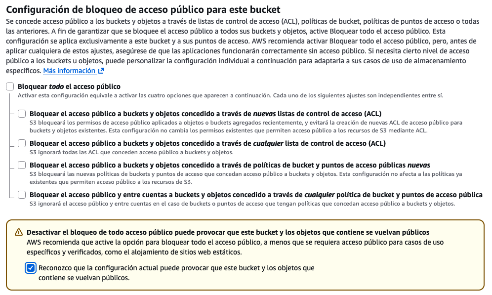
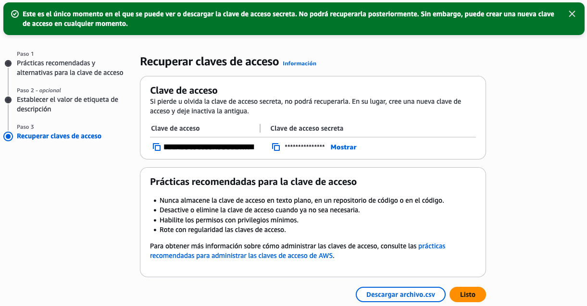
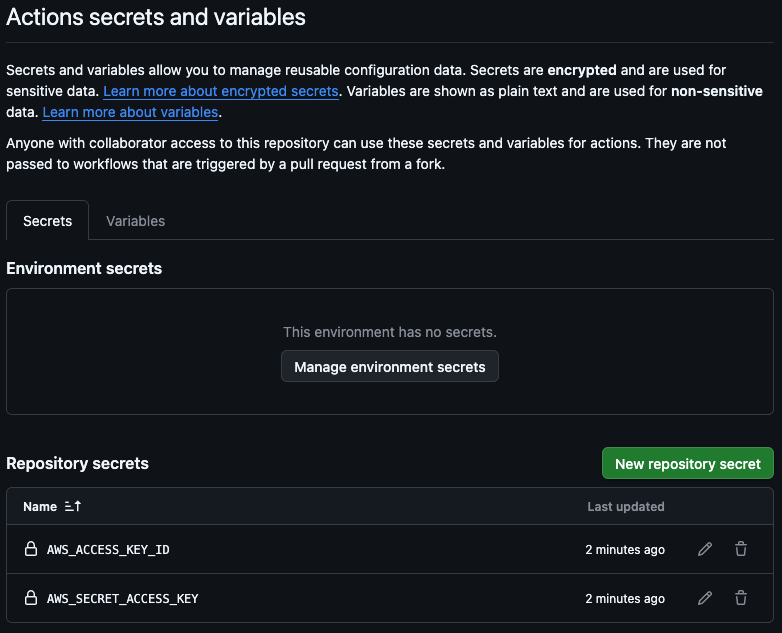
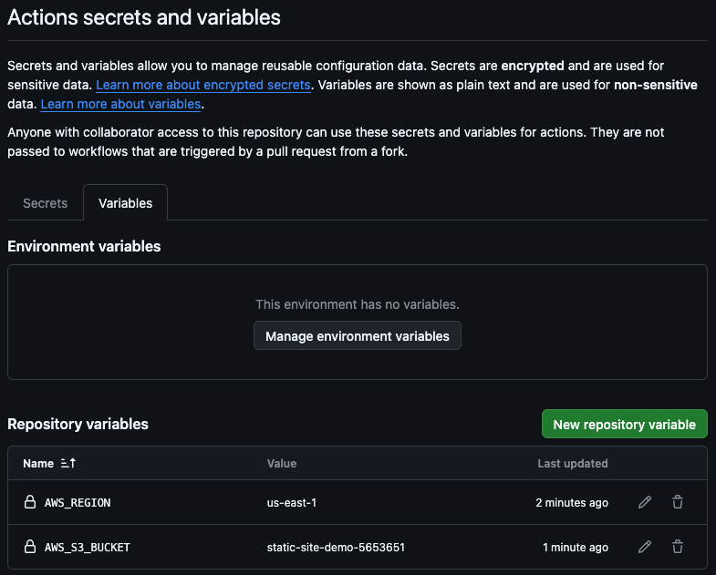
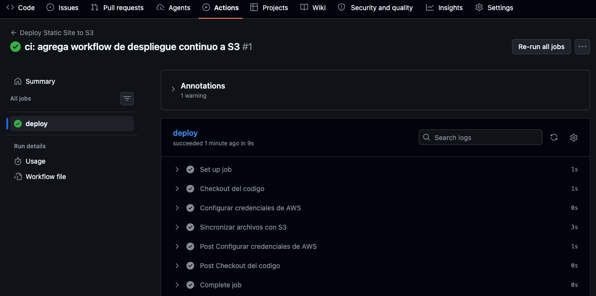
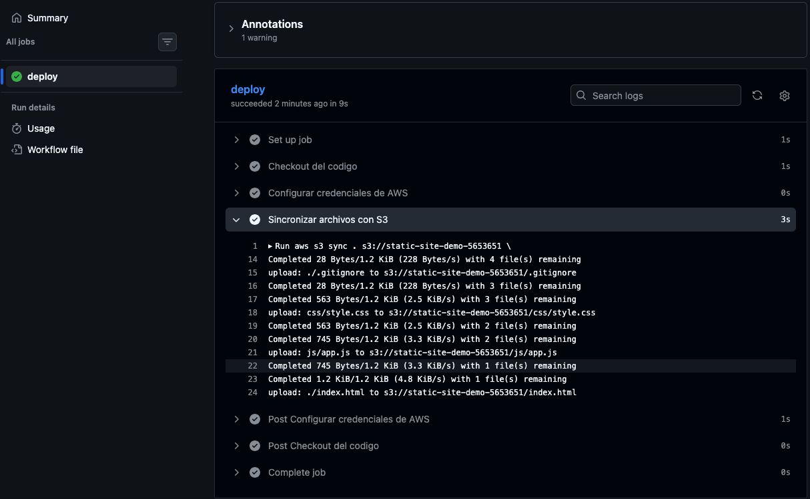
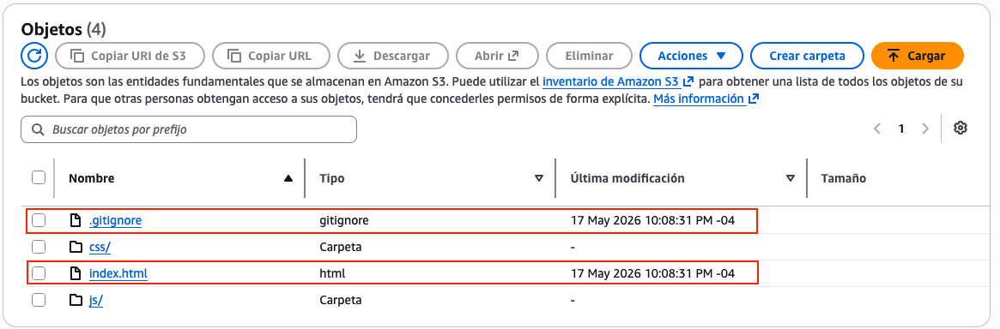
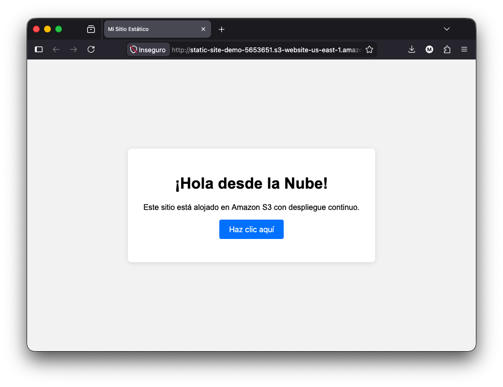
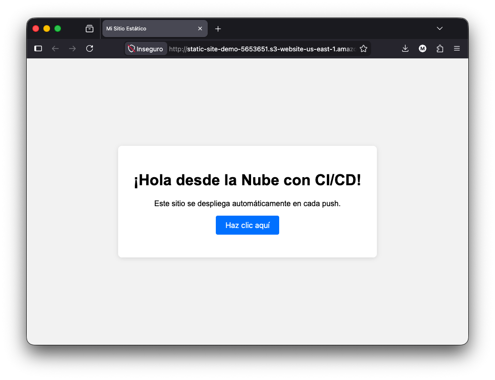

# Laboratorio 6.1: Despliegue de una Aplicación Web Estática con CI/CD ☁️

## 1. Objetivos del Laboratorio 🎯

Al finalizar este laboratorio, el estudiante será capaz de:

- Crear y estructurar un **sitio web estático** con HTML, CSS y JavaScript.
- Configurar un bucket de **Amazon S3** para alojamiento web estático.
- Gestionar permisos públicos y políticas de acceso en S3 de forma segura.
- Crear un usuario **IAM** con permisos mínimos necesarios para despliegue.
- Configurar **GitHub Actions** para automatizar el despliegue continuo a S3.
- Gestionar **secretos y variables** en GitHub de forma segura.
- (Opcional) Configurar **Amazon CloudFront** como CDN e invalidar la caché automáticamente.
- Comprender el flujo completo de **CI/CD aplicado a servicios gestionados** en la nube.

## 2. Requisitos ⚙️

- Tener una cuenta activa de **Amazon Web Services (AWS)** con acceso a los servicios de Nivel Gratuito (Free Tier).
- Tener una cuenta activa de **GitHub**.
- Tener **Git** instalado localmente.
- Tener un editor de código (se recomienda **VS Code**).
- Disponer de un navegador web para acceder a las consolas de AWS y GitHub.
- (Opcional) Tener instalada la **AWS CLI** para pruebas locales.

## 3. Ejercicios 🧪

### Ejercicio 3.1: Creación del sitio web estático y repositorio en GitHub

1. Crea una carpeta local para tu proyecto, por ejemplo `static-site-demo`.

2. Dentro de la carpeta, crea la siguiente estructura de archivos:

    ```text
    static-site-demo/
    ├── index.html
    ├── css/
    │   └── style.css
    └── js/
        └── app.js
    ```

3. Crea un archivo `index.html` con el siguiente contenido base:

    ```html
    <!DOCTYPE html>
    <html lang="es">
    <head>
      <meta charset="UTF-8">
      <meta name="viewport" content="width=device-width, initial-scale=1.0">
      <title>Mi Sitio Estático</title>
      <link rel="stylesheet" href="css/style.css">
    </head>
    <body>
      <div class="container">
        <h1>¡Hola desde la Nube!</h1>
        <p>Este sitio está alojado en Amazon S3 con despliegue continuo.</p>
        <button id="btn">Haz clic aquí</button>
        <p id="message"></p>
      </div>
      <script src="js/app.js"></script>
    </body>
    </html>
    ```

4. Crea el archivo `css/style.css`:

    ```css
    body {
      font-family: Arial, sans-serif;
      background: #f4f4f4;
      display: flex;
      justify-content: center;
      align-items: center;
      height: 100vh;
      margin: 0;
    }
    .container {
      background: white;
      padding: 2rem;
      border-radius: 8px;
      box-shadow: 0 2px 10px rgba(0,0,0,0.1);
      text-align: center;
    }
    button {
      padding: 10px 20px;
      font-size: 16px;
      cursor: pointer;
      border: none;
      background: #007bff;
      color: white;
      border-radius: 4px;
    }
    button:hover {
      background: #0056b3;
    }
    ```

5. Crea el archivo `js/app.js`:

    ```javascript
    document.getElementById('btn').addEventListener('click', () => {
      document.getElementById('message').textContent =
        '¡Desplegado automáticamente con GitHub Actions!';
    });
    ```

6. Abre el archivo `index.html` en tu navegador localmente y verifica que se vea correctamente.

7. Inicializa un repositorio Git, crea un repositorio en GitHub y súbelo:

    ```bash
    git init
    git add .
    git commit -m "feat: inicializa sitio web estatico"
    git branch -M main
    git remote add origin https://github.com/TU_USUARIO/static-site-demo.git
    git push -u origin main
    ```

### Ejercicio 3.2: Creación y configuración del bucket S3

1. Inicia sesión en la **Consola de AWS** y navega al servicio **S3**.

2. Haz clic en **Create bucket** y configura lo siguiente:

    - **Bucket name:** Un nombre único global (ej. `static-site-demo-tu-ci`).
    - **AWS Region:** Selecciona la región más cercana (ej. `us-east-1`).
    - **Block all public access:** **Desmarca** esta opción y confirma que entiendes los riesgos.
    - **Todas las demás opciones déjalas por defecto**.

    

3. Una vez creado el bucket, accede a él y ve a la pestaña **Propiedades**.

4. Desplázate hasta la sección **Alojamiento de sitios web estáticos** y haz clic en **Editar**:

    - **Alojamiento de sitios web estáticos:** Habilitar.
    - **Tipo de alojamiento:** Alojamiento de sitios web estáticos.
    - **Documento de índice:** `index.html`
    - **Documento de error:** `error.html` (opcional, puedes dejarlo vacío por ahora).

    Guarda los cambios.

5. Ve a la pestaña **Permisos** y en **Política de bucket** haz clic en **Editar**. Agrega la siguiente política para permitir acceso público de lectura:

    ```json
    {
      "Version": "2012-10-17",
      "Statement": [
        {
          "Sid": "PublicReadGetObject",
          "Effect": "Allow",
          "Principal": "*",
          "Action": "s3:GetObject",
          "Resource": "arn:aws:s3:::NOMBRE_DE_TU_BUCKET/*"
        }
      ]
    }
    ```

    > **Importante:** Reemplaza `NOMBRE_DE_TU_BUCKET` con el nombre real de tu bucket.

6. Guarda la política. Verifica que en **Permisos > Bloquear acceso público (configuración del bucket) > Bloquear todo el acceso público** esté deshabilitado.

7. (Verificación manual opcional) En la pestaña **Objetos**, sube manualmente los archivos del sitio web y accede al **Punto de enlace de sitio web del bucket** que aparece al final de la pestaña **Propiedades** para confirmar que funciona.

### Ejercicio 3.3: Configuración de credenciales AWS y secretos en GitHub

1. En la Consola de AWS, navega al servicio **IAM**.

2. Ve a **Usuario de IAM** y haz clic en **Crear persona**:

    - **Nombre de usuario:** `github-actions-s3-deploy`
    - No marques la opción de acceso a la consola (solo acceso programático).

3. En el paso de permisos, selecciona **Adjuntar políticas directamente** y busca **AmazonS3FullAccess**. Selecciónalo y continúa.

    > **Nota:** En un entorno de producción real, deberías crear una política personalizada con permisos mínimos (`s3:PutObject`, `s3:DeleteObject`, `s3:ListBucket`) solo sobre el bucket específico.

4. Revisa y crea el usuario.

5. Una vez creado, selecciona el usuario y ve a la pestaña **Credenciales de seguridad** y haz clic en **Crear clave de acceso**:

    - Selecciona **Otros** como caso de uso, dale **Siguiente** y luego **Crear clave de acceso**.
    - Guarda el **Clave de acceso** y el **Clave de acceso secreto** en un lugar seguro (solo se muestran una vez).

    

6. Ve a tu repositorio en GitHub y accede a **Settings > Secrets and variables > Actions**.

7. Haz clic en **New repository secret** y crea los siguientes secretos:

    | Nombre del secreto | Valor esperado |
    |---|---|
    | `AWS_ACCESS_KEY_ID` | El Access key ID generado en IAM |
    | `AWS_SECRET_ACCESS_KEY` | El Secret access key generado en IAM |

8. Ve a la pestaña **Variables** (dentro de Secrets and variables > Actions) y crea las siguientes variables de repositorio:

    | Nombre de la variable | Valor esperado |
    |---|---|
    | `AWS_REGION` | La región de tu bucket (ej. `us-east-1`) |
    | `AWS_S3_BUCKET` | El nombre exacto de tu bucket S3 |

    

    

    > **Nota:** Las variables (`vars`) se utilizan para configuraciones no sensibles, mientras que los secretos (`secrets`) enmascaran automáticamente sus valores en los logs.

### Ejercicio 3.4: Creación del workflow de GitHub Actions para despliegue continuo

1. En la raíz de tu repositorio local, crea la carpeta y el archivo del workflow:

    ```bash
    mkdir -p .github/workflows
    touch .github/workflows/deploy.yml
    ```

2. Abre el archivo `.github/workflows/deploy.yml` y agrega el siguiente contenido:

    ```yaml
    name: Deploy Static Site to S3

    on:
      push:
        branches: [main]

    jobs:
      deploy:
        runs-on: ubuntu-latest

        steps:
          - name: Checkout del codigo
            uses: actions/checkout@v4

          - name: Configurar credenciales de AWS
            uses: aws-actions/configure-aws-credentials@v4
            with:
              aws-access-key-id: ${{ secrets.AWS_ACCESS_KEY_ID }}
              aws-secret-access-key: ${{ secrets.AWS_SECRET_ACCESS_KEY }}
              aws-region: ${{ vars.AWS_REGION }}

          - name: Sincronizar archivos con S3
            run: |
              aws s3 sync . s3://${{ vars.AWS_S3_BUCKET }} \
                --delete \
                --exclude ".git/*" \
                --exclude ".github/*" \
                --exclude "README.md" \
                --exclude "INFORME.md"
    ```

    > **Nota:** El flag `--delete` elimina archivos del bucket que ya no existen en el repositorio, manteniendo sincronizados ambos entornos. Las exclusiones evitan subir archivos innecesarios.

3. Crea un archivo `.gitignore` para evitar subir archivos no deseados:

    ```bash
    node_modules/
    .env
    .DS_Store
    ```

4. Guarda los cambios, realiza commit y push:

    ```bash
    git add .
    git commit -m "ci: agrega workflow de despliegue continuo a S3"
    git push origin main
    ```

5. Ve a la pestaña **Actions** de tu repositorio en GitHub y verifica que el workflow se haya ejecutado exitosamente.

    

6. Haz clic sobre el nombre del workflow para inspeccionar los logs de cada paso.

    

### Ejercicio 3.5: Verificación del despliegue automático

1. Accede a la **Consola de AWS > S3**, selecciona tu bucket y verifica en la pestaña **Objects** que los archivos del sitio web se hayan sincronizado correctamente.

    

2. Ve a la pestaña **Properties** y copia la **Bucket website endpoint**. Ábrela en tu navegador.

    ```
    http://NOMBRE_DE_TU_BUCKET.s3-website-REGION.amazonaws.com
    ```

    Deberías ver tu sitio web estático funcionando.

    

3. Para probar el despliegue continuo, realiza un cambio visible en tu sitio web. Por ejemplo, modifica el `index.html`:

    ```html
    <h1>¡Hola desde la Nube con CI/CD!</h1>
    <p>Este sitio se despliega automáticamente en cada push.</p>
    ```

4. Guarda los cambios, haz commit y push:

    ```bash
    git add index.html
    git commit -m "feat: actualiza titulo del sitio"
    git push origin main
    ```

5. Observa en la pestaña **Actions** cómo el workflow se dispara automáticamente. Espera a que finalice.

6. Refresca la URL de tu sitio web y verifica que el cambio esté reflejado.

    

7. **Simulación de fallo intencional:** Modifica el workflow y agrega un bucket inexistente, o revoca temporalmente las credenciales. Observa cómo el workflow **falla** ❌. Corrige el error y vuelve a desplegar.

## 4. Práctica Individual 💻

El estudiante debe demostrar autonomía aplicando lo aprendido a un proyecto propio.

1. Crea un nuevo repositorio en GitHub (público o privado) con un **sitio web estático** propio. Puede ser:
   - Un portafolio personal.
   - Una landing page para un producto o servicio ficticio.
   - Una página de presentación de un proyecto académico.
   - Un sitio generado con un framework estático como **Vite**, **Astro**, **11ty** o **Hugo**.

2. El sitio web debe contener al menos:
   - Una página principal (`index.html`).
   - Hojas de estilo CSS personalizadas.
   - Al menos un archivo JavaScript con interactividad básica.
   - (Opcional) Múltiples páginas enlazadas entre sí.

3. Configura un pipeline de despliegue continuo en GitHub Actions que incluya:
   - **Checkout** del código.
   - **Configuración de credenciales AWS** usando secrets.
   - **Sincronización** con un bucket S3 propio usando `aws s3 sync`.
   - Exclusiones adecuadas para no subir archivos innecesarios.

4. Configura **Amazon CloudFront**:
   - Crea una distribución con origen en tu bucket S3.
   - Usa **Origin Access Control (OAC)** para restringir el acceso directo al bucket.
   - Agrega un paso de **invalidación de caché** en tu workflow de GitHub Actions.
   - Documenta la URL de CloudFront (HTTPS) en tu informe.

5. Crea un archivo `INFORME.md` en la raíz del repositorio que contenga:
   - Una breve descripción del sitio web y del pipeline configurado.
   - Capturas de pantalla que demuestren:
     - El bucket S3 creado y configurado para hosting web.
     - Los secretos y variables configurados en GitHub.
     - El historial de ejecuciones en la pestaña **Actions** (al menos un éxito y un fallo intencional corregido).
     - El sitio web funcionando accesible públicamente (URL de S3 y CloudFront).
     - La distribución de CloudFront configurada.
   - La URL pública completa donde se puede acceder al sitio web.
   - Conclusiones sobre la utilidad del despliegue continuo para sitios estáticos.

6. En el archivo `README.md` del repositorio, agrega una sección de **Documentación** o **Entrega** que enlace al `INFORME.md`:

    ```markdown
    ## Documentación del Laboratorio

    Puedes encontrar el informe completo con capturas de pantalla y evidencias en el siguiente enlace:

    - [Ver informe del laboratorio](./INFORME.md)
    ```

La práctica se considerará exitosa al presentar:
- El **enlace al repositorio** con el código fuente y el workflow de GitHub Actions.
- La **URL pública** donde el sitio web está desplegado y funcionando (endpoint de S3 o dominio de CloudFront).
- El **informe completo** (`INFORME.md`) con todas las evidencias solicitadas.
