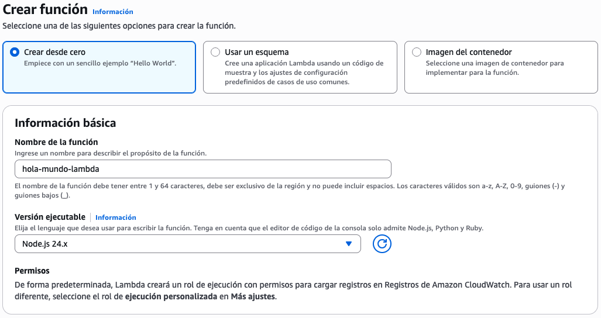

# Laboratorio 6.2: Despliegue y Uso de una Función Serverless ⚡

## 1. Objetivos del Laboratorio 🎯

Al finalizar este laboratorio, el estudiante será capaz de:

- Crear y configurar una **función AWS Lambda** desde la consola de administración.
- Escribir código de función serverless en **Node.js** y **Python**.
- Configurar **triggers** (disparadores) como API Gateway para invocar funciones vía HTTP.
- Probar funciones con **eventos de prueba** y validar las respuestas.
- Revisar **logs y métricas** en Amazon CloudWatch.
- Desplegar funciones con dependencias externas usando la **AWS CLI**.
- (Opcional) Automatizar el despliegue de funciones serverless mediante **GitHub Actions**.

## 2. Requisitos ⚙️

- Tener una cuenta activa de **Amazon Web Services (AWS)** con acceso a los servicios de Nivel Gratuito (Free Tier).
- Tener una cuenta activa de **GitHub**.
- Tener **Git** instalado localmente.
- Tener un editor de código (se recomienda **VS Code**).
- (Opcional) Tener instalada la **AWS CLI** para despliegues por línea de comandos.
- Disponer de un navegador web para acceder a las consolas de AWS y GitHub.

## 3. Ejercicios 🧪

### Ejercicio 3.1: Creación de una función Lambda desde la consola

1. Inicia sesión en la **Consola de AWS** y navega al servicio **Lambda**.

2. Haz clic en **Create function** y selecciona **Author from scratch**.

3. Configura los siguientes parámetros básicos:

    - **Nombre de la función:** `hola-mundo-lambda`
    - **Versión ejecutable:** Selecciona **Node.js 24.x** (también puedes usar Python 3.14 si lo prefieres).

    

4. Haz clic en **Create function**. AWS creará la función con un código de ejemplo.

5. En la pestaña **Code**, reemplaza el código por el siguiente handler en Node.js:

    ```javascript
    export const handler = async (event) => {
      const nombre = event.queryStringParameters?.nombre || 'Mundo';

      const response = {
        statusCode: 200,
        headers: {
          'Content-Type': 'application/json',
        },
        body: JSON.stringify({
          mensaje: `Hola, ${nombre}!`,
          timestamp: new Date().toISOString(),
        }),
      };

      return response;
    };
    ```

    > **Nota:** Si seleccionaste Python como runtime, usa este código equivalente:
    > ```python
    > import json
    > from datetime import datetime
    >
    > def lambda_handler(event, context):
    >     nombre = event.get('queryStringParameters', {}).get('nombre', 'Mundo')
    >
    >     return {
    >         'statusCode': 200,
    >         'headers': {
    >             'Content-Type': 'application/json'
    >         },
    >         'body': json.dumps({
    >             'mensaje': f'Hola, {nombre}!',
    >             'timestamp': datetime.now().isoformat()
    >         })
    >     }
    > ```

6. Haz clic en **Deploy** para guardar los cambios.

### Ejercicio 3.2: Prueba de la función con eventos

1. En la consola de tu función Lambda, haz clic en la pestaña **Test**.

2. Crea un nuevo evento de prueba haciendo clic en **Create test event**:

    - **Event name:** `testConNombre`
    - **Template:** Selecciona **apigateway-aws-proxy** (simula una petición HTTP a través de API Gateway).
    - Modifica el JSON para incluir parámetros de consulta:

    ```json
    {
      "queryStringParameters": {
        "nombre": "Estudiante"
      }
    }
    ```

3. Haz clic en **Save** y luego en **Test**.

4. Observa los resultados de la ejecución:

    - **Execution result:** `succeeded`
    - El log debería mostrar el objeto de retorno con el mensaje personalizado.

    

5. Crea otro evento de prueba llamado `testSinNombre` con el JSON vacío `{}` y verifica que la función retorne `Hola, Mundo!` como valor por defecto.

6. **Analiza el log de ejecución:** revisa las métricas de duración, memoria utilizada y billed duration.

### Ejercicio 3.3: Configuración de API Gateway como trigger HTTP

1. En la consola de tu función Lambda, ve a la pestaña **Configuration** y luego a **Triggers** (o **Function URL**).

2. El método más sencillo es crear una **Function URL**:

    - Ve a **Configuration > Function URL**.
    - Haz clic en **Create function URL**.
    - **Auth type:** Selecciona **NONE** (público) para este laboratorio.
    - Guarda la configuración.

    > **Nota:** En producción real, se recomienda usar **AWS_IAM** o integrar con Amazon Cognito para autenticación.

    

3. Copia la **Function URL** generada (tiene un formato como `https://<id>.lambda-url.<region>.on.aws/`).

4. Ábrela en tu navegador y verifica que retorne el JSON con `Hola, Mundo!`.

5. Prueba pasando un parámetro por query string:

    ```
    https://TU-FUNCTION-URL/?nombre=Cloud
    ```

    Deberías recibir una respuesta personalizada.

    

6. (Alternativa avanzada) Si prefieres usar **API Gateway REST API** en lugar de Function URL:

    - Ve a la pestaña **Triggers > Add trigger**.
    - Selecciona **API Gateway**.
    - **API type:** REST API
    - **Security:** Open (público para el laboratorio)
    - Guarda y copia la URL del endpoint generado.

### Ejercicio 3.4: Despliegue de función con dependencias usando AWS CLI

En este ejercicio aprenderás a desplegar una función Lambda que utiliza dependencias externas (paquetes npm o librerías de Python).

1. En tu máquina local, crea una carpeta para el proyecto Lambda:

    ```bash
    mkdir lambda-with-deps && cd lambda-with-deps
    npm init -y
    npm install axios
    ```

    > **Nota:** Estamos instalando `axios` como ejemplo de dependencia externa que la función utilizará para hacer peticiones HTTP.

2. Crea un archivo `index.js` con el siguiente contenido:

    ```javascript
    import axios from 'axios';

    export const handler = async (event) => {
      try {
        // Ejemplo: consultar una API pública
        const response = await axios.get('https://api.github.com/users/github');

        return {
          statusCode: 200,
          headers: { 'Content-Type': 'application/json' },
          body: JSON.stringify({
            mensaje: 'Datos obtenidos exitosamente',
            datos: {
              login: response.data.login,
              id: response.data.id,
              public_repos: response.data.public_repos,
            },
          }),
        };
      } catch (error) {
        return {
          statusCode: 500,
          headers: { 'Content-Type': 'application/json' },
          body: JSON.stringify({
            mensaje: 'Error al obtener datos',
            error: error.message,
          }),
        };
      }
    };
    ```

3. Modifica el `package.json` para indicar que es un módulo ES:

    ```json
    {
      "name": "lambda-with-deps",
      "version": "1.0.0",
      "type": "module",
      "dependencies": {
        "axios": "^1.7.0"
      }
    }
    ```

4. Empaqueta el código y las dependencias en un archivo ZIP:

    ```bash
    zip -r function.zip index.js node_modules package.json
    ```

    > **Nota:** En Windows puedes usar el comando `Compress-Archive` de PowerShell o cualquier herramienta de compresión.

5. Crea una nueva función Lambda en la consola de AWS llamada `lambda-con-dependencias`.

6. En la consola de la función, ve a **Code** y en **Upload from** selecciona **.zip file**. Sube el archivo `function.zip`.

    

7. Una vez subido, cambia el **Runtime handler** a `index.handler` (si es necesario) y haz clic en **Deploy**.

8. Crea una **Function URL** para esta nueva función y prueba accediendo desde el navegador.

    Deberías ver un JSON con los datos del usuario `github` obtenidos a través de `axios`.

    

### Ejercicio 3.5: Revisión de logs en CloudWatch

1. En la consola de AWS, navega al servicio **CloudWatch**.

2. Ve a **Logs > Log groups** y busca el grupo de logs asociado a tu función Lambda. El nombre suele seguir este patrón:

    ```
    /aws/lambda/hola-mundo-lambda
    ```

3. Haz clic en el grupo de logs y luego en el **log stream** más reciente.

4. Revisa las entradas de log:

    - **START:** Indica el inicio de una invocación.
    - **END:** Indica la finalización.
    - **REPORT:** Muestra métricas clave: duration, billed duration, memory size, max memory used.

    ```
    REPORT RequestId: xxxxxxxx-xxxx-xxxx-xxxx-xxxxxxxxxxxx
    Duration: 12.34 ms    Billed Duration: 13 ms
    Memory Size: 128 MB   Max Memory Used: 65 MB
    ```

    

5. (Opcional) Ve a **CloudWatch > Metrics** y busca las métricas de tu función Lambda. Puedes visualizar:

    - **Invocations:** Número de invocaciones.
    - **Duration:** Tiempo de ejecución.
    - **Errors:** Errores acumulados.
    - **Throttles:** Invocaciones limitadas por concurrencia.

### Ejercicio 3.6: (Opcional) Despliegue continuo con GitHub Actions

1. En la raíz de tu proyecto local `lambda-with-deps`, inicializa un repositorio Git y súbelo a GitHub.

2. Crea el archivo `.github/workflows/deploy-lambda.yml`:

    ```yaml
    name: Deploy Lambda Function

    on:
      push:
        branches: [main]

    jobs:
      deploy:
        runs-on: ubuntu-latest

        steps:
          - name: Checkout del codigo
            uses: actions/checkout@v4

          - name: Configurar Node.js
            uses: actions/setup-node@v4
            with:
              node-version: '20'

          - name: Instalar dependencias
            run: npm ci

          - name: Empaquetar funcion
            run: |
              zip -r function.zip index.js node_modules package.json

          - name: Configurar credenciales de AWS
            uses: aws-actions/configure-aws-credentials@v4
            with:
              aws-access-key-id: ${{ secrets.AWS_ACCESS_KEY_ID }}
              aws-secret-access-key: ${{ secrets.AWS_SECRET_ACCESS_KEY }}
              aws-region: ${{ vars.AWS_REGION }}

          - name: Actualizar codigo de Lambda
            run: |
              aws lambda update-function-code \
                --function-name ${{ vars.LAMBDA_FUNCTION_NAME }} \
                --zip-file fileb://function.zip
    ```

3. Configura los secretos y variables en GitHub:

    | Tipo | Nombre | Valor |
    |---|---|---|
    | Secret | `AWS_ACCESS_KEY_ID` | Access key de IAM |
    | Secret | `AWS_SECRET_ACCESS_KEY` | Secret key de IAM |
    | Variable | `AWS_REGION` | Región de la función (ej. `us-east-1`) |
    | Variable | `LAMBDA_FUNCTION_NAME` | Nombre exacto de la función Lambda |

    > **Nota:** El usuario IAM necesita el permiso `lambda:UpdateFunctionCode` además de los permisos básicos.

4. Realiza commit y push:

    ```bash
    git add .
    git commit -m "ci: agrega pipeline de despliegue para lambda"
    git push origin main
    ```

5. Verifica en la pestaña **Actions** que el workflow se ejecute correctamente y que la función Lambda se actualice automáticamente.

## 4. Práctica Individual 💻

El estudiante debe demostrar autonomía desarrollando una función serverless con un caso de uso real.

1. Crea una nueva función Lambda (o reutiliza la del ejercicio) que implemente uno de los siguientes casos de uso:

   - **API de conversión:** Recibe una cantidad en una moneda y retorna la conversión a otra (puedes usar una API pública de tasas de cambio).
   - **Procesador de imágenes:** Recibe una URL de imagen, la descarga y retorna sus dimensiones o formato.
   - **Validador de datos:** Recibe un JSON con información de un formulario y valida campos obligatorios, formatos de email, etc.
   - **Notificador:** Recibe un evento y envía una notificación simulada (puede retornar un objeto que represente el mensaje que se enviaría).
   - **Generador de reportes:** Recibe parámetros (rango de fechas, categoría) y retorna un JSON con datos estructurados simulando un reporte.

2. La función debe cumplir con los siguientes requisitos:
   - Estar escrita en **Node.js** o **Python**.
   - Aceptar parámetros de entrada (query string o body JSON).
   - Retornar una respuesta HTTP con código de estado apropiado (`200` para éxito, `400` para errores de validación, `500` para errores internos).
   - Incluir **manejo de errores** con `try/catch` o bloques `except`.

3. Configura al menos **un trigger** para tu función:
   - **Function URL** (obligatorio).
   - (Opcional) **API Gateway REST API** para rutas más complejas.
   - (Opcional) **Evento de S3** (ejecutar la función cuando se suba un archivo a un bucket).

4. Documenta las pruebas realizadas:
   - Al menos **3 eventos de prueba** diferentes (éxito, error de validación, caso edge).
   - Capturas de pantalla de la consola Lambda mostrando los resultados.
   - La URL pública (Function URL) para que el docente pueda probarla.

5. Revisa los **logs en CloudWatch** y documenta:
   - Duración promedio de ejecución.
   - Memoria máxima utilizada.
   - Algún error o timeout que hayas experimentado y cómo lo solucionaste.

6. (Opcional pero recomendado) Configura un pipeline de **GitHub Actions** para desplegar tu función automáticamente.

7. Crea un archivo `INFORME.md` en la raíz del repositorio que contenga:
   - Descripción del caso de uso elegido y la lógica implementada.
   - Decisiones técnicas (lenguaje, triggers, manejo de errores).
   - Capturas de pantalla que demuestren:
     - La función creada en la consola AWS.
     - Las pruebas con eventos exitosos.
     - Las pruebas con eventos de error.
     - Los logs en CloudWatch.
     - (Opcional) El workflow de GitHub Actions funcionando.
   - La **URL pública** de la función (Function URL o API Gateway).
   - Reflexión sobre las ventajas y limitaciones de las funciones serverless.

8. En el archivo `README.md` del repositorio, agrega una sección de **Documentación** o **Entrega** que enlace al `INFORME.md`:

    ```markdown
    ## Documentación del Laboratorio

    Puedes encontrar el informe completo con capturas de pantalla y evidencias en el siguiente enlace:

    - [Ver informe del laboratorio](./INFORME.md)
    ```

La práctica se considerará exitosa al presentar:
- El **enlace al repositorio** con el código fuente de la función.
- La **URL pública** donde la función está accesible y funcionando.
- El **informe completo** (`INFORME.md`) con todas las evidencias solicitadas.
- (Opcional) El historial de ejecuciones del workflow en GitHub Actions.
